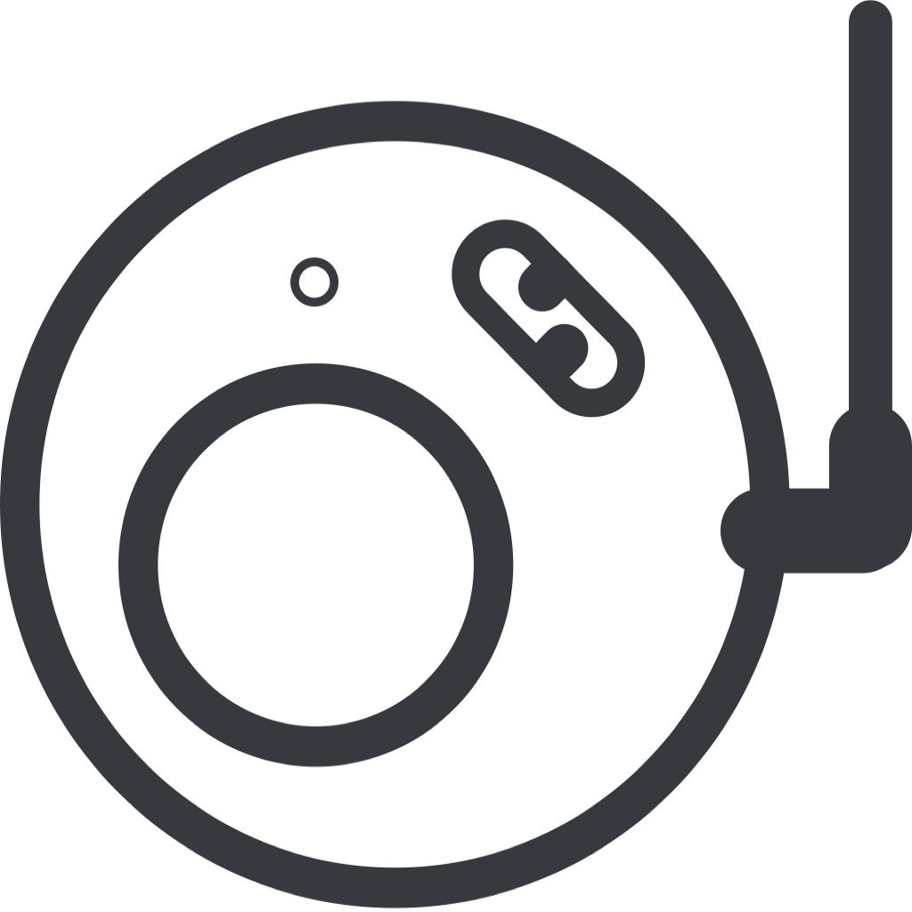

<div align="center">



# UCSF BioRouter

**An AI-powered integrated research environment for biomedical discovery**

<p>

  <a href="https://opensource.org/licenses/Apache-2.0"></a>
</p>

</div>


## What is BioRouter?

[UCSF BioRouter](https://baranzinilab.github.io/biorouter-landing/intro.html) is an AI-powered integrated research environment that unifies commercial, institution-hosted, and local LLMs, AI agents, Information Commons databases, and customizable workflows into one extensible tool for explorative analysis, prototyping, automation, and federated cross-institution collaboration.

Think of BioRouter as your intelligent research co-pilot — one that can read papers, query databases, run code, manage files, and carry out complex multi-step research tasks, all from a single unified interface.

<br>

## Key Features

- **Multi-Provider LLM Support** — Works with Anthropic Claude, OpenAI GPT, Google Gemini, Amazon Bedrock, Azure OpenAI, Ollama (local), and many more
- **UCSF Institution-Ready** — Built-in support for UCSF-hosted ChatGPT (Azure) and UCSF-hosted Anthropic (Bedrock)
- **Extensible via MCP Agents** — Connect to databases, web tools, file systems, APIs, and custom agents through the Model Context Protocol
- **Recipes & Automation** — Package any workflow into a shareable, reusable recipe; run it on a schedule without lifting a finger
- **Fully Local Mode** — Use Ollama for completely air-gapped, private inference — nothing ever leaves your machine
- **Skills System** — Teach BioRouter your team's workflows and best practices as reusable instruction sets
- **Desktop & CLI** — Beautiful GUI desktop app for interactive work; CLI for scripting and automation

<br>

## Download

Native installers for all major platforms are available in every release:

| Platform | Package |
|----------|---------|
| **macOS** (Apple Silicon) | `.zip` — unzip and drag to `/Applications` |
| **Windows** (x64) | `.zip` — unzip and run `BioRouter.exe` |
| **Linux** Ubuntu / Pop!_OS (x64) | `.deb` — `sudo dpkg -i biorouter_*.deb` |
| **Linux** Fedora / RHEL (x64) | `.rpm` — `sudo rpm -i BioRouter-*.rpm` |

**[Download BioRouter →](https://baranzinilab.github.io/biorouter-landing/download.html)**

Always install the newest version for the latest features and fixes.

<br>

## Getting Started in 3 Steps

**1. Download and install** BioRouter from the [Releases page](https://github.com/BaranziniLab/BioRouter/releases).

**2. Connect a provider** — On first launch, BioRouter will walk you through choosing an LLM provider:
- **UCSF users**: Select Azure OpenAI (UCSF ChatGPT) or Amazon Bedrock (UCSF Anthropic)
- **With your own API key**: Enter your Anthropic, OpenAI, or Google API key directly
- **Fully local**: Install [Ollama](https://ollama.com) and select it — no API key needed, no data leaves your device

**3. Start exploring** — Type a question, describe a task, or load a recipe. BioRouter takes it from there.

<br>

## Who is BioRouter For?

- **Researchers** who want to analyze data, review literature, and run bioinformatics pipelines with the help of AI
- **Clinicians and data scientists** who need secure, institution-compliant AI access for sensitive research tasks
- **Developers and engineers** building automated workflows, pipelines, and agentic systems
- **Teams** looking to share reusable AI workflows as recipes across their organization

<br>

## Working with Sensitive Data

BioRouter routes your inputs to an LLM provider. For patient data, PHI, or other sensitive research data:

- **Use institution-managed services** (UCSF Azure OpenAI or UCSF Amazon Bedrock) or **fully local Ollama**
- **Do not** use personal commercial API keys with patient data
- **Always verify** with your institution's compliance office before processing sensitive data

See the [Data Privacy Guide](documentation/data-privacy.md) for full details.

<br>

## Documentation

In-depth documentation is available in the [documentation/](documentation/) folder:

| Guide | Description |
|---|---|
| [Architecture](documentation/architecture.md) | How BioRouter is built — backend, frontend, agent loop |
| [Providers & Models](documentation/providers-and-models.md) | All supported LLM providers and models |
| [Extensions, Skills & MCP](documentation/extensions-skills-mcp.md) | Adding tools, agents, and reusable skills |
| [Recipes](documentation/recipes.md) | Creating and sharing automated workflows |
| [Schedulers](documentation/schedulers.md) | Running recipes on a schedule |
| [Installation & Setup](documentation/installation-setup.md) | Step-by-step setup guide |
| [Data Privacy](documentation/data-privacy.md) | Guidelines for handling patient and sensitive data |

<br>

## Acknowledgments

BioRouter's agentic coding environment was developed with reference to the following open-source AI coding tools — we are grateful to their authors and communities:

- **[Goose](https://block.github.io/goose/)** — CLI/Desktop agent for full developer workflows (Block) — BioRouter's primary upstream foundation
- **[Aider](https://aider.chat/)** — Open-source, Git-native CLI AI coding agent
- **[Cline](https://github.com/cline/cline)** — Open-source interactive CLI coding agent
- **[OpenCode](https://opencode.ai/)** — Open-source coding agent with multi-session and multi-provider support
- **[ForgeCode](https://forgecode.dev/)** — Terminal AI coding assistant for task planning and code generation

<br>

## Citation

If you use BioRouter in your research, please cite:

```bibtex
@software{biorouter2025,
  title  = {UCSF BioRouter: An AI-Powered Integrated Research Environment},
  author = {Gu, Wanjun, Bellucci, Gianmarco and Baranzini, Sergio E.},
  year   = {2025},
  url    = {https://github.com/BaranziniLab/BioRouter}
}
```

<br>

## About

UCSF BioRouter is developed by **Wanjun Gu** ([wanjun.gu@ucsf.edu](mailto:wanjun.gu@ucsf.edu)) at the [Baranzini Lab](https://baranzinilab.ucsf.edu/), Department of Neurology, UCSF Bakar Computational Health Sciences Institute. Development is supported by **UCSF IT** and **Information Commons**.

Licensed under the [Apache License 2.0](LICENSE).

<br>

<div align="center">
  <p>
    <a href="https://github.com/BaranziniLab/BioRouter/releases">Download</a> ·
    <a href="documentation/installation-setup.md">Setup Guide</a> ·
    <a href="https://github.com/BaranziniLab/BioRouter/issues">Report an Issue</a> ·
    <a href="mailto:wanjun.gu@ucsf.edu">Contact</a>
  </p>
</div>
