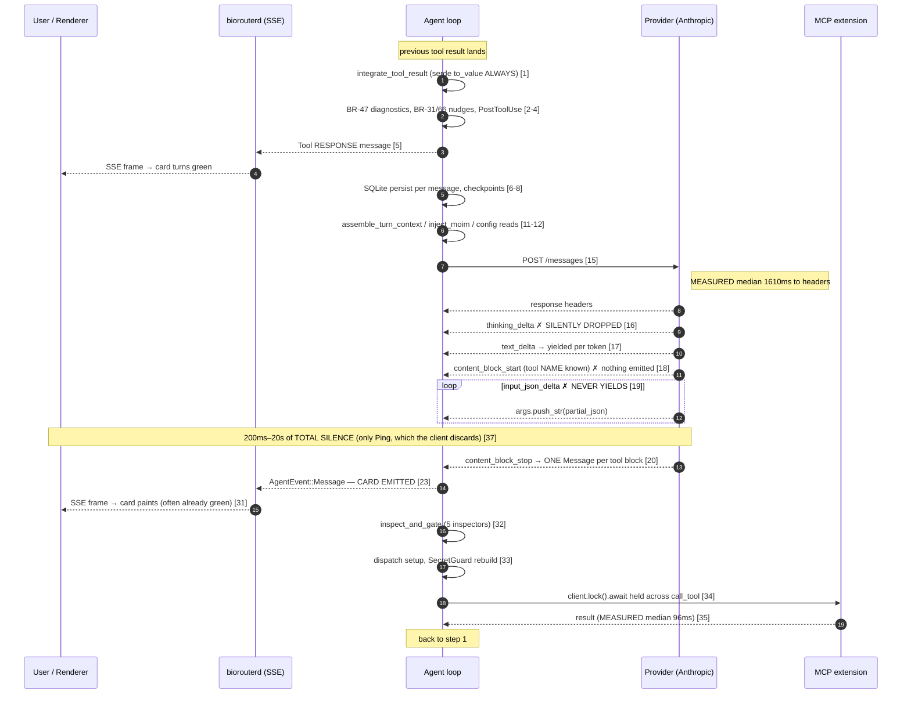

# Tool-call UI latency — investigation report

> **What this is.** The founding investigation of the July 2026 streaming campaign: why a tool
> card appeared late and already finished, why there was a dead gap between consecutive tool
> calls, and the two tracks of work proposed to fix both.
> **Status:** Historical record (completed 2026-07-18). The fixes it proposed were implemented
> and verified; see the [implementation status](streaming-implementation-status.md) for what
> actually landed.
> **Audience:** developers working on the agent loop's streaming decoders, tool dispatch, and the
> desktop transcript.

Two symptoms were reported and are investigated separately below as **A** and **B**. Read §0
first: it was added after the investigation completed and it supersedes §3 as the primary
explanation of symptom A, because the reporting user's provider turned out not to stream at all.
Hypotheses carry `H<n>` identifiers, introduced where they are first stated and resolved in §5;
proposed fixes carry the section numbers `§6.1a`–`§6.2d`, which the implementation status and the
[measurement register](latency-measurement-register.md) both cite.

**Date:** 2026-07-18
**Repo:** `/Users/wanjun/Desktop/biorouter` (branch `chore/remove-dashboard-mode`, HEAD `b9a37d72`)
**Symptoms investigated:**
- **A** — "the tool call appears late" (a tool card shows up long after the model must have decided to call it, and looks already finished when it arrives)
- **B** — "there is a gap between tool calls" (2–5s of apparent nothing between one tool finishing and the next starting)

**Evidence base:** verbatim source reading at HEAD; an 82–86 MB production server log (`~/.local/state/biorouter/logs/server/2026-07-05/20260705_223517-biorouterd.log`, 94 tool calls) independently re-analyzed by three verifiers; one runtime decoder test; one standalone mutex-shape microbenchmark; one rendered-component assertion. Where a claim was **not** measured, it is labeled as such.

---

## 0. CRITICAL ADDENDUM — the reporting user's provider does not stream at all

*Added after the workflow completed, during verification of its "blocking open question". This supersedes §3 as the primary explanation of symptom A **for this user's configuration**.*

The report flagged as blocking that `base.rs:648` defaults `supports_streaming()` to `false` and that `lead_worker.rs` never overrides it. That is correct, but it under-scoped the problem: **the user's own configured provider is affected directly, with no lead model involved.**

```text
~/.config/biorouter/config.yaml:178  BIOROUTER_PROVIDER: versa_azure
~/.config/biorouter/config.yaml:179  BIOROUTER_MODEL: gpt-5.5-2026-04-24
```

`crates/biorouter/src/providers/versa_azure.rs` implements `Provider` (`:142`) with **only** `complete_with_model` (`:185`). It has no `stream` implementation and no `supports_streaming` override, so it inherits:

```rust
// crates/biorouter/src/providers/base.rs:648-650
fn supports_streaming(&self) -> bool {
    false
}
```

Which sends every turn down the non-streaming branch of the fork at `crates/biorouter/src/agents/reply_parts.rs:220-245`:

```rust
let stream_result = if provider.supports_streaming() {
    debug!("WAITING_LLM_STREAM_START");
    let result = provider.stream(...).await;   // <- NOT taken for versa_azure
...
} else {
    debug!("WAITING_LLM_START");
    let complete_result = provider.complete(...).await;   // <- taken: blocks until the ENTIRE turn is generated
    debug!("WAITING_LLM_END");
    match complete_result {
        Ok((message, usage)) => Ok(stream_from_single_message(message, usage)),
```

**Consequence.** `stream_from_single_message` fabricates a one-element stream *after* generation has fully completed. So for this user there is no partial anything — not text, not thinking, not tool arguments. The tool card cannot appear until the model has finished generating the **entire** assistant turn, tool arguments and all. Symptom A is therefore not merely "arguments buffer invisibly" (H1, which describes the *streaming* Anthropic path); it is the strictly worse case: **nothing at all is emitted until the whole turn is done**, at which point the card and its execution appear together.

This also reframes §4: the measured `WAITING_LLM_START → _END` median of **7.9 s** on the non-streaming path (vs 1.61 s for `WAITING_LLM_STREAM_START → _END`) is not a slower model — it is the same model measured to *end of generation* rather than to *first byte*. The user's entire inter-tool-call gap is one opaque `complete()` call.

**Blast radius — 14 providers inherit `supports_streaming() == false`:**

`azure`, `bedrock`, `claude_code`, `codex`, `cursor_agent`, `gemini_cli`, `lead_worker`, `litellm`, `sagemaker_tgi`, `snowflake`, `testprovider`, `venice`, `versa_azure`, `versa_bedrock`

Some of these are genuinely non-streaming CLI shims (`claude_code`, `codex`, `gemini_cli`, `cursor_agent`). But `azure`, `versa_azure`, `versa_bedrock`, `bedrock`, `litellm`, and `snowflake` all front APIs that **do** support SSE streaming — they are non-streaming only because nobody implemented `stream` for them. `versa_azure` is an Azure OpenAI-compatible endpoint, so the existing `openai.rs` streaming decoder is very likely reusable.

**Revised priority.** For this user, implementing `stream` for `versa_azure` is the single highest-impact change in this document — larger than every UI fix combined, because it is the difference between "one opaque multi-second block" and "progressive output". It should be validated against the same provider before the H1 `input_json_delta` fix, which for this user changes nothing.

**Caveat, stated honestly:** the 7.9 s figure comes from the workflow's log analysis, which I did not independently re-derive; and I have not verified that the Versa Azure endpoint accepts `"stream": true` with tool calling. Both need confirming before committing to the fix. The configuration facts and the code path above are verified verbatim.

---

## 1. Summary

1. **This is not primarily a latency bug — it is a representation bug.** Of a typical 3.0s gap: **~90–93% is intrinsic model time**, ~1–5% is agent-loop overhead, **<0.1%** is transport, and 3–8% is client rendering. Measured backend bookkeeping between a tool completing and the next provider request is **3.3–6.0 ms median, 16.7 ms p90** — a ratio of roughly **490:1** against the provider round trip. Optimizing that 1–5% would not move the perception at all.

2. **The backend already emits the tool card at the earliest instant it can.** Verified: `agent.rs:3389` yields `AgentEvent::Message(filtered_response)` strictly **before** gating (`agent.rs:3461`) and **before** dispatch (`agent.rs:3562`). Symptom A is not the agent loop withholding the card.

3. **The card is late because ~1.2 s of tool-argument JSON streams invisibly.** `crates/biorouter/src/providers/formats/anthropic.rs:599-608` — the `input_json_delta` branch does `args.push_str(...)` and **never yields**, while the text branch immediately above it *does*. The tool **name** is already known at `content_block_start` (`:575`) and is discarded. Magnitude is **bimodal**: ~70–150 ms for `{"command":"ls -la"}` (below the observability floor — H1 does *not* explain a multi-second gap on small-arg tools), but **6–13 s** for a 30-line `str_replace` and **22–50 s** for a 200-line `text_editor write`. The OpenAI-compat decoder (`openai.rs:543-600`, ~18 providers) is **worse**: it drains the entire stream before emitting anything, so N parallel calls are withheld until the *last* one's args finish.

4. **When the card does arrive it lies.** `ToolCallWithResponse.tsx:646-656` derives status from *array position* (`isStreamingComplete = !isStreamingMessage`), not from data. Empirically reproduced: identical data renders `"Ran Running sleep 60 · Finished"` (green) when not last, `"Working on …"` when last. Combined with a ~96 ms median tool duration, a card that appears exactly at execution start reads as "already finished."

5. **Real wall-clock waste exists, but only on multi-tool turns.** Two confirmed defects convert `max(tool durations)` into `sum(tool durations)`: the native Anthropic/Google decoders emit **one Message per tool block** so `select_all` never sees >1 future (`anthropic.rs:612-656`, runtime-confirmed as `[1, 1]` not `[2]`), and the MCP client mutex is held across the entire `call_tool` await (`extension_manager.rs:1391-1398`). Measured cost of the latter: exactly `(N−1) × per-call latency` — **6 concurrent calls take 2421 ms instead of 416 ms**.

**Bottom line for a busy reader:** ship the UI/representation fixes (Track 2 + §6 Stage 1). They convert 1–20 s of already-elapsed invisible time into visible progress and cost nothing in risk. Then ship the two concurrency fixes (§6 Stage 2), which are the only changes that remove real wall-clock — and only on multi-tool turns.

---

## 2. How a tool call actually flows

### 2.1 End-to-end timeline

| # | Step | Layer | File | Est. ms | Intrinsic? |
|---|------|-------|------|---------|------------|
| 1 | Previous tool's result lands; `integrate_tool_result` validates, guardrail-scans, and `serde_json::to_value()`s the **entire** result (even with zero PostToolUse hooks) | agent-loop | `crates/biorouter/src/agents/agent.rs:1414-1430` | 1–50 ms (O(payload); 10–100 ms for multi-MB output) | no |
| 2 | BR-47 post-edit tree-sitter diagnostics re-parse every file a `text_editor` write touched | agent-loop | `agent.rs:3607-3691` | 0 when inactive (default); 5–200 ms/file | no |
| 3 | Failure-loop nudges (BR-31) + mistake-streak (BR-66) scan the transcript since last user turn, locking and cloning every response slot | agent-loop | `agent.rs:3699-3733` | 1–20 ms | no |
| 4 | PostToolUse hook fan-out (`join_all`, parallel) — a `has_hooks` probe per result first | agent-loop | `agent.rs:3741-3841` | 0 with no hooks | no |
| 5 | **Tool RESPONSE message yielded** — the UI finally learns the tool finished | agent-loop | `agent.rs:3871-3887` | 1–5 ms | no |
| 6 | `record_turn_usage` (SQLite write) + `current_token_state` (SQLite read) + `TokenUsage` event | agent-loop | `agent.rs:4070-4086` | 1–5 ms | no |
| 7 | Persist the iteration: one SQLite BEGIN/COMMIT **per message**, serially; each does a redundant `SELECT COUNT(*) FROM sqlite_master` FTS probe + `UPDATE sessions` | agent-loop | `session/session_manager.rs:2925-2982` (driven from `agent.rs:4168-4171`) | ~0.2–1 ms each; 10–60 ms for a wide batch (~2N+1 txns) | no |
| 8 | `settle_fired_hooks` + `maybe_checkpoint(PostStep)` — git shadow-repo re-hash of the work tree | agent-loop | `agent.rs:4178-4197` | <5 ms (checkpoints off by default); 100 ms–5 s with `ALPHA=true` | no |
| 9 | Loop top: cancel check, provider mutex, turn/tool-call/stall/budget guards, soft-interrupt drain | agent-loop | `agent.rs:3036-3143` | <1 ms | no |
| 10 | `stall_check` — a **real extra provider round-trip**, at action 30 then every 10. Only in-loop LLM call site (`agent.rs:3149`) | model | `agents/stall.rs:62-77` | 0 for actions 1–29; 300 ms–30 s when it fires | no |
| 11 | `assemble_turn_context` → `inject_moim`: deep-clones the entire `Vec<Message>`, strips stale MOIM, calls `workspace_summary`, `get_moim` on every platform MCP client, then re-normalizes | agent-loop | `agents/moim.rs:68-120` + `workspace_summary.rs:133-170` | 1–30 ms typical | no |
| 12 | ~4–8 `Config::global().get_param()` calls, each a `std::fs::read_to_string` + full YAML parse of `config.yaml`, uncached | agent-loop | `config/base.rs:768 → 426-451` | <10 ms, but blocking syscalls on a tokio worker | no |
| 13 | `create_request`: `format_messages` (clones + rewrites every message, stamps `cache_control`), `format_tools`, `format_system` — nothing memoized | provider | `providers/formats/anthropic.rs:394-487` | <10 ms typical; 10–50 ms on a long conversation | no |
| 14 | **No token counting happens here.** `check_if_compaction_needed`'s hot-path call site is `agent.rs:2777`, inside `reply()`, *outside* the loop; happy path reads `session.total_tokens` from SQLite | agent-loop | `context_mgmt/mod.rs:527-635` | **0 ms/iteration** | yes |
| 15 | HTTP POST; await response headers (`WAITING_LLM_STREAM_START` → `_END`) | provider | `agents/reply_parts.rs:221-230` | **MEASURED median 1610 ms, p90 2770 ms, max 3370 ms** | yes |
| 16 | Model prefill + reasoning. `thinking_delta` events arrive and are **silently dropped** — the Anthropic streaming decoder has no thinking branch | model | `formats/anthropic.rs:583-610` | seconds; the dominant term | yes (cost) / no (visibility) |
| 17 | Model streams preamble text; each `text_delta` yields one Message → one SSE frame | provider | `formats/anthropic.rs:583-598` | ~10–50 ms/token | yes |
| 18 | `content_block_start` for the `tool_use` block: the tool **name is now known** — and is never surfaced | provider | `formats/anthropic.rs:545-581` | 0 ms (missed opportunity) | no |
| 19 | **`input_json_delta` fragments accumulate SILENTLY into a local String.** This branch only does `args.push_str` and never yields. **Single largest contributor to symptom A.** | provider | `formats/anthropic.rs:599-608` | 200 ms–5 s; 10 s+ for a large write | no |
| 20 | `content_block_stop`: parse accumulated JSON, build the `tool_request` Message, yield it. **One message per `tool_use` block** | provider | `formats/anthropic.rs:612-656` | <1 ms | no |
| 21 | Agent rewrap: `set_current_model` (global `std::sync::Mutex`), optional `toolshim_postprocess` (a full extra Ollama round-trip per chunk) | agent-loop | `reply_parts.rs:260-276` | <1 ms normally | no |
| 22 | `categorize_tools`: schema-driven arg coercion, two `is_frontend_tool` mutex awaits per request | agent-loop | `reply_parts.rs:284-370` | <1 ms | no |
| 23 | **`yield AgentEvent::Message(filtered_response)` — THE TOOL CARD IS EMITTED HERE**, strictly before gating (3461) and dispatch (3562) | agent-loop | `agent.rs:3389-3390` | <1 ms | no |
| 24 | `stream_event`: `serde_json` + `format!("data: {}\n\n")` → `mpsc::channel(100)`. `DeltaCoalescer` is pass-through and never coalesces tool requests | transport | `biorouter-server/src/routes/reply.rs:229-249, 259-265` | <1 ms | no |
| 25 | hyper writes to socket; `CompressionLayer` correctly exempts `text/event-stream`; **TCP_NODELAY is not set** | transport | `biorouter-server/src/commands/agent.rs:64-83` | <1 ms loopback; ~40 ms in a Nagle pathology | no |
| 26 | Renderer: `fetch` ReadableStream → `TextDecoderStream` → split `\n\n` → `JSON.parse` → generator yield | frontend | `ui/desktop/src/api/core/serverSentEvents.gen.ts:151-235` | <1 ms | no |
| 27 | `chatStreamStore`: `pushMessage` merges by message id, then **three** separate `updateSnapshot` calls each firing `notify()` | react | `ui/desktop/src/hooks/chatStreamStore.tsx:104-143, 601-612` | 1–10 ms ×3 | no |
| 28 | `BaseChat` re-renders: four full-transcript scans (`collectArtifactsFromMessages`, `countToolRequests`, `collectCodeDelta`, `commandHistory`) keyed on a `messages` identity that changes every frame | react | `ui/desktop/src/components/BaseChat.tsx:1424-1429, 545-587` | 1–50 ms/event, O(transcript bytes) | no |
| 29 | `ProgressiveMessageList` gating: ≤50 msgs early-returns synchronously; >50 re-schedules `loadNextBatch` at `batchDelay=20` | react | `ProgressiveMessageList.tsx:67-134` | 0 ms (≤50) / ~20 ms (>50) | no |
| 30 | Every message component re-renders — none of `ProgressiveMessageList`/`BioRouterMessage`/`UserMessage`/`ToolCallWithResponse` is `React.memo`'d | react | `BioRouterMessage.tsx:47` | 5–200 ms/event × mounted count | no |
| 31 | Tool card paints. `isStreamingComplete = !isStreamingMessage; shouldShowAsComplete = isStreamingComplete && !toolResponse → 'success'` | react | `ToolCallWithResponse.tsx:646-656` | n/a | no |
| 32 | Backend meanwhile runs the inspector gauntlet (5 inspectors serially; a PreToolUse rewrite forces a second pass), then human approval serially (3600 s TTL) | agent-loop | `tool_inspection.rs:99-144` + `tool_execution.rs:165-415` | 1–10 ms pattern-only; 50–500 ms with ML; unbounded with approval | no |
| 33 | Dispatch setup per tool, serially: 3 `extensions.lock()` acquisitions, prefix scan, `SecretGuard` rebuilt from scratch every call (GitignoreBuilder + 2 stats + up to 2 file reads + globset compile, sync `std::fs` on the async worker) | mcp | `agents/extension_manager.rs:1290-1382` + `biorouter-mcp/src/secret_guard.rs:87-115` | ~1–3 ms/tool | no |
| 34 | `select_all` drives the tool futures; each takes the 8-permit semaphore and sorted per-path write locks, **then `client.lock().await` held across the entire `call_tool`** | mcp | `extension_manager.rs:1385-1405` | 0 for one call; **sum rather than max** otherwise | no |
| 35 | MCP JSON-RPC round trip; 3-way select over response / 300 s timeout / cancel | server | `agents/mcp_client.rs:522-543` | **MEASURED median 96 ms, p90 23.0 s, max 66.9 s** | yes |
| 36 | `large_response_handler`: char pre-filter, tokenize on `spawn_blocking`, write offload file with **synchronous `std::fs`** on the async runtime | agent-loop | `agents/large_response_handler.rs:113-199, 287-315` | <1 ms typical | no |
| 37 | Result returns to step 1. **The SSE stream carries only `Ping` (which the client explicitly discards) for the whole of steps 1–23** | frontend | `chatStreamStore.tsx:628-631` | n/a | no |

### 2.2 Sequence diagram



---

## 3. Why the tool call appears late (symptom A)

**Consensus: CONFIRMED** (H1), with two corrections.

### 3.1 The mechanism, verbatim

`crates/biorouter/src/providers/formats/anthropic.rs:599-608` — the `input_json_delta` branch contains **no `yield`**:

```rust
  587    if let Some(text) = delta.get("text").and_then(|v| v.as_str()) {
  588        accumulated_text.push_str(text);
  ...
  597        yield (Some(message), None);        // <-- text DOES stream
  ...
  599  } else if delta.get("type") == Some(&json!("input_json_delta")) {
  600      // Tool input delta
  601      if let Some(tool_id) = &current_tool_id {
  602          if let Some(partial_json) = delta.get("partial_json").and_then(|v| v.as_str()) {
  603              if let Some((_name, args)) = accumulated_tool_calls.get_mut(tool_id) {
  604                  args.push_str(partial_json);   // <-- tool args do NOT
  605              }
  606          }
  607      }
  608  }
```

The tool **name** is known long before, at `content_block_start` (`anthropic.rs:575-577`), and is merely stashed:

```rust
  575    if let Some(name) = content_block.get("name").and_then(|v| v.as_str()) {
  576        accumulated_tool_calls.insert(id.to_string(), (name.to_string(), String::new()));
  577    }
```

The sole emission is at `content_block_stop` (`anthropic.rs:612-655`), gated on the accumulated string parsing as complete JSON (`:620`) before `yield (Some(message), None);` (`:654`).

### 3.2 No buffer exists anywhere downstream — every layer was checked

- `anthropic.rs:301-312` forwards each decoder item straight through.
- `reply_parts.rs:196-275` `stream_response_from_provider` is a pure pass-through (`while let Some(result) = stream.next().await { ... yield (message, usage); }`); only toolshim post-processing.
- `agent.rs:3338` `while let Some(next) = stream.next().await` → `agent.rs:3389-3390`:
  ```rust
  3387    } = self.categorize_tools(&response, &tools).await;
  3389    yield AgentEvent::Message(filtered_response.clone());
  3390    tokio::task::yield_now().await;
  ```
  gating is at `3461`, dispatch at `3562`. **The emit genuinely precedes both.**
- `reply.rs:315-323` `DeltaCoalescer::push` — `if coalescable_delta_text(&msg).is_none() { out.push(msg); return out; }`; `sse_coalesce_window()` defaults to `Duration::ZERO` (`reply.rs:258-264`).
- `chatStreamStore.tsx:590-612` applies each Message synchronously; no throttle/rAF/debounce in the file.
- `BioRouterMessage.tsx:208-220` renders `<ToolCallWithResponse>` as soon as `getToolRequests(message)` is non-empty.
- `MessageContent` (`crates/biorouter/src/conversation/message.rs:192-203`) has **no partial/streaming tool-call variant at all**.

### 3.3 Magnitude — honest, and bimodal

At Sonnet/Opus output rates of ~40–90 tok/s, pre-card invisible time = `arg_tokens / rate`:

| Argument | ~tokens | Invisible window |
|---|---|---|
| `{"command":"ls -la"}` | 6 | **70–150 ms — below the observability floor** |
| a long shell command | 20–25 | 250–500 ms (borderline) |
| `text_editor str_replace`, 30 lines (~1800 chars) | ~520 | **6–13 s** |
| `text_editor write`, 200 lines (~7000 chars) | ~2000 | **22–50 s** |

**Correction to H1 as originally stated:** this is *not* a uniform 200 ms–5 s tax. If the user's observation was on a read/list/short-shell tool, H1 does **not** explain a multi-second gap there and something else is responsible. H1 is a confirmed primary cause specifically for edit/write/large-payload tools.

### 3.4 Scope correction — this is provider-wide, and OpenAI-compat is worse

`crates/biorouter/src/providers/formats/openai.rs:543-600` is strictly worse. On the first `tool_calls` delta it enters an inner drain loop:

```rust
let is_complete = chunk.choices[0].finish_reason == Some("tool_calls".to_string());
if !is_complete {
    let mut done = false;
    while !done {
        if let Some(response_chunk) = stream.next().await {
            ... args.push_str(&delta_call.function.arguments); ...
            if tool_chunk.choices[0].finish_reason.is_some() { done = true; }
```

consuming the **entire remainder of the stream**, then at `openai.rs:610-663` building **one** message containing **all** tool calls and yielding once at `:661`. With N parallel calls, every card is withheld until the **last** call's args finish — the delay is the **sum**, not the max. ~18 providers route through this module (openai, azure, litellm, githubcopilot, ollama, llamacpp, openrouter, xai, zai, databricks, google, versa_azure, tetrate, xiaomi_mimo, snowflake, toolshim, gcpvertexai). A fix confined to `anthropic.rs` leaves all of them unchanged.

Second defect in the same loop: it inspects only `delta.tool_calls` and `reasoning_details`, **never `delta.content`**, so text interleaved after a tool call is silently dropped.

### 3.5 The card also *lies* when it arrives (H2, CONTESTED but the rendering defect is CONFIRMED)

`ui/desktop/src/components/ToolCallWithResponse.tsx:644-656`, verbatim:

```ts
  // Check if streaming has finished but no tool response was received
  // This is a workaround for cases where the backend doesn't send tool responses
  const isStreamingComplete = !isStreamingMessage;
  const shouldShowAsComplete = isStreamingComplete && !toolResponse;
  const toolError = getToolResultError(toolResponse?.toolResult);

  const loadingStatus: LoadingStatus = !toolResponse
    ? shouldShowAsComplete
      ? 'success'
      : 'loading'
    : toolError
      ? 'error'
      : 'success';
```

`isStreamingMessage` is supplied **positionally** by `ProgressiveMessageList.tsx:231-236`:

```tsx
                isStreaming={
                  isStreamingMessage &&
                  !isUser &&
                  index === messagesToRender.length - 1 &&
                  message.role === 'assistant'
                }
```

**Empirically reproduced** by rendering the real component with `toolResponse=undefined`:

```text
isStreamingMessage={false} -> "Ran Running sleep 60 · Finished"                   (green/success)
isStreamingMessage={true}  -> "Working on Running sleep 60 · Working through …"   (amber/loading)
```

Same data, opposite state, decided solely by position. The green dot comes from `ToolCallStatusIndicator.tsx:17-18` (`case 'success': return 'bg-background-success';`). The `'pending'` variant declared at `ToolCallStatusIndicator.tsx:4` is **dead code** — `getToolCallStatus` (`ToolCallWithResponse.tsx:699-710`) switches exhaustively over the three `LoadingStatus` values in `Dot.tsx:1`, so `default: return 'pending'` is unreachable and `bg-background-strong` never paints.

**Scope correction (important, and it narrows H2):** `agent.rs:3871-3887` emits **all** of a batch's tool responses only after `combined.next()` fully drains:

```rust
for (idx, request) in frontend_requests.iter().chain(remaining_requests.iter()).enumerate() {
    ...
    let final_response = tool_response_messages[idx].lock().await.clone();
    yield AgentEvent::Message(final_response.clone());
```

so a tool-response message **cannot** demote a still-pending sibling of the same batch. `McpNotification` (`agent.rs:3591`) routes to `updateNotifications` (`chatStreamStore.tsx:637`), not `messages`, so it cannot demote either. The three **real** demoters are:

- `agent.rs:3512` — `while let Some(msg) = tool_approval_stream.try_next().await? { yield AgentEvent::Message(msg); }`
- `agent.rs:3533-3544` — hook inline system notifications
- `agent.rs:3573` — mid-loop elicitation drains, inside `while let Some((request_id, item)) = combined.next().await`

So today the wrong-state window requires a confirmation prompt, a hook system message, or a mid-batch elicitation — not the routine multi-tool turn. **Fix it anyway**: it is unambiguously wrong, it is cheap, and §6 Stage 2c will *widen* the exposure by emitting responses mid-batch.

### 3.6 Two further findings on the same path

**Thinking is dropped entirely on the streaming path — a correctness bug, not just cosmetics.** The `content_block_delta` arm handles **only** `text_delta` and `input_json_delta`. The streaming event arms are exactly `message_start`, `content_block_start`, `content_block_delta`, `content_block_stop`, `message_delta`, `message_stop` — there is no `thinking_delta`/`signature_delta` anywhere. The **non-streaming** parser *does* handle it (`anthropic.rs:262-278`, `message = message.with_thinking(thinking, signature);`), proving the omission is an oversight. Thinking is enabled at `anthropic.rs:451-452` (`CLAUDE_THINKING_ENABLED` or a deep-effort budget), so a deep-effort turn emits nothing for its **whole thinking phase** — typically far longer than argument generation. It also drops thinking blocks from the persisted streamed message, which **Anthropic rejects when replayed** on a subsequent tool turn with thinking on.

**"Execution starts within ~1 ms of the card" is false in smart-approve mode.** `permission_inspector.rs:423` → `permission_judge.rs:152-161`:

```rust
let res = provider.complete(&system_prompt, check_messages.messages(), std::slice::from_ref(&tool)).await;
```

A full extra LLM round-trip runs **after** the card yield (`agent.rs:3389`) and **before** dispatch, for any tool not yet graded. It caches per tool name (`update_smart_approve_permission`), so first-use only — but that is precisely the case users notice.

---

## 4. Why there is a gap between tool calls (symptom B)

**Consensus: CONFIRMED (H3) — the gap is overwhelmingly the provider round-trip, and it is not fixable.**

### 4.1 Measurements (three independent verifiers, same log corpus)

| Span | n | median | p90 | max |
|---|---|---|---|---|
| Tool completed → next LLM request (**all** backend bookkeeping) | 92 / 44 | **3.3–6.0 ms** | 9.6–16.7 ms | 128.9 ms |
| `provider.stream()` open (payload serialize + TTFB) | 55 | **1607.9 ms** | 2621–2767 ms | 3367.0 ms |
| `provider.complete()` full (non-streaming path) | 63 | **7865.3 ms** | 22977.5 ms | 95320.2 ms |
| MCP JSON-RPC round trip (actual tool execution) | — | **96 ms** | 23.0 s | 66.9 s |

Full sorted bookkeeping list (ms), n=44: `2.7, 2.8, 3.0, 3.0, 3.3, 3.6, 3.7, 3.7, 4.2, 4.7, 4.8, 4.9, 4.9, 4.9, 5.0, 5.0, 5.0, 5.0, 5.3, 5.4, 5.4, 5.9, 6.1, 6.1, 6.3, 6.3, 6.4, 6.4, 6.6, 7.4, 7.8, 8.5, 9.4, 9.6, 10.6, 12.3, 12.7, 16.4, 16.7, 21.3, 24.1, 33.6, 128.9, 27318197.9` (last = an idle next-day session-resume boundary).

Raw adjacent markers confirm the tightness directly:

```text
2026-07-06T09:33:55.540355Z Tool call completed
2026-07-06T09:33:55.541531Z WAITING_LLM_START      (1.2ms)
2026-07-06T09:34:00.169224Z Tool call completed
2026-07-06T09:34:00.170706Z WAITING_LLM_START      (1.5ms)
```

**Zero of 92 samples exceeded the 200 ms falsification bar.** Ratio of provider round-trip to backend bookkeeping: **~490:1 streaming, ~2380:1 non-streaming.**

### 4.2 Latency budget for a 3.0 s gap

| Component | Share | Verdict |
|---|---|---|
| LLM time-to-first-token (request sent → response headers) — ~1.6 s | **~53%** | **INTRINSIC.** Includes server-side prefill. A cold pool adds 100 ms–1 s; non-default reasoning effort rebuilds the provider each turn (`agent.rs:1910`) and discards the warm pool. |
| LLM generation after first token — preamble plus the **entire tool-argument JSON streaming invisibly** — ~1.2 s | **~40%** | **INTRINSIC in cost, ~100% INVISIBLE by construction** (`anthropic.rs:599-608` never yields). This window is precisely what makes the card seem to arrive at the last second. |
| Agent-loop bookkeeping (unconditional `serde_json::to_value`, per-message SQLite txns, MOIM deep clone, re-normalize, 4–8 uncached `config.yaml` reads, request re-serialization) — 5–30 ms | **0.2–1%** | Engineering overhead, genuinely negligible at the median. Degrades to 100 ms–2 s (3–40%) only if the `workspace_summary` tree walk re-fires. |
| Transport (SSE serialize, mpsc, hyper, loopback) — 1–2 ms | **<0.1%** | Compression correctly exempted. Only latent risk is missing TCP_NODELAY (~40 ms in a Nagle/delayed-ACK pathology). |
| Client rendering (three `notify()` fan-outs, four whole-transcript memo scans, unmemoized re-render, 20 ms batch timer) — 25–70 ms | **3–5%** (up to ~250 ms / ~8% on a 1000+ component session) | Real but a smoothness tax, not a discrete gap. |

**Net: ~90–93% intrinsic model time, 1–5% agent-loop overhead, <0.1% transport, 3–8% client rendering.**

### 4.3 What is *not* on the hot path (rule these out permanently)

- **Token counting.** `check_if_compaction_needed` has one hot-path-relevant call site (`agent.rs:2777`, inside `reply()`, *outside* the loop). Its happy path is `context_mgmt/mod.rs:551`:
  ```rust
  let (current_tokens, token_source) = match session.total_tokens {
      Some(tokens) => (tokens as usize, "session metadata"),
  ```
  with an early bail at `:546` (`if threshold <= 0.0 || threshold >= 1.0 { return Ok(false); }`).
  *Correction:* there is a **second** production call site at `context_mgmt/mod.rs:711` inside `run_eager_compaction`, which is **default-ON** and does fire a full `compact_messages` LLM call. It is off the critical path *by construction* — `tokio::spawn`'d from `agent.rs:1715` with a non-blocking `self.provider.try_lock()` that bails on contention (`agent.rs:1673-1679`). Do not "optimize" it: the `try_lock` + `eager_swap_is_safe` snapshot-length guard exist to protect against clobbering a concurrent turn via `replace_conversation`'s DELETE+reinsert.
- **Prompt caching is already implemented and working.** `anthropic.rs:151-202` stamps `cache_control` on the last two user messages and the last tool spec. Log confirms: `cache_read_input_tokens: 112717, 113210, 115207, 115590, 117424, 118326` against `cache_creation_input_tokens: 655, 2159, 545, 1996, 1064, 1484, 336, 256, 278`. Only ~0.3–2 k tokens are re-created per turn against ~115 k read.
- **Compression is not stalling SSE.** `CompressionLayer::new()` wraps the router (`biorouter-server/src/commands/agent.rs:62`) — the classic trap — but tower-http's `DefaultPredicate` includes `NotForContentType` for `text/event-stream`, which `SseResponse::into_response` sets explicitly (`routes/reply.rs:126-135`). Deliberate; see the comment at `agent.rs:59-61`.
- **No Electron proxy or IPC hop.** The renderer talks to `biorouterd` over plain HTTP (`renderer.tsx:452-458`); main-process `webRequest` handlers only rewrite CSP (`main.ts:4130`) and stamp `Origin` (`main.ts:4178`). `setProxy` (`main.ts:352`) only fires with `HTTP(S)_PROXY` set.
- **Blocking payload log I/O.** `providers/anthropic.rs:286` calls `RequestLog::start` before the POST, but `providers/utils.rs:506-508` buffers the opening line in memory and `utils.rs:554-560` defers disk work to a detached `spawn_blocking`.
- **Post-edit tree-sitter diagnostics** (`agent.rs:3607-3690`) sit exactly in symptom B's gap and do a synchronous `analyzer.diagnose_file()` on the runtime thread — but are **default-off** (`post_edit_diagnostics.rs:46-52`, `enabled: false`).

### 4.4 Instrumentation caveat — the markers are mislabeled

`WAITING_LLM_STREAM_START` → `_END` (`reply_parts.rs:220-229`) brackets only **stream creation**:

```rust
            debug!("WAITING_LLM_STREAM_START");
            let result = provider
                .stream(system_prompt.as_str(), messages_for_provider.messages(), &tools)
                .await;
            debug!("WAITING_LLM_STREAM_END");
```

`provider.stream()` returns at **response headers** (`providers/anthropic.rs:292` `request.response_post(&payload).await`, then `:299` `response.bytes_stream()`). So the 1.61 s is **payload-serialize + TTFB only** — generation lives entirely in the un-instrumented span after `_END`. Every prior investigation of this codebase has re-made this mistake.

Likewise `WAITING_TOOL_START`/`WAITING_TOOL_END` (`agent.rs:2055` / `:2133`) bracket only **dispatch setup** — `dispatch_tool_call` returns `ToolCallResult { result: Box::new(Box::pin(async move { ... })) }` **un-awaited** (`agent.rs:2161-2181`); real execution happens later under `select_all`. These markers are strictly non-overlapping on **every** provider, so any "prove tools run serially" test built on them is invalid and confirms the hypothesis regardless of truth. `developer__shell` logs START→END in 0.1 ms while the command takes seconds; real execution lands in `WAITING_TOOL_END → "Tool call completed"` (measured median 84.2 ms, p90 23.0 s, max 66.9 s).

### 4.5 Multi-tool turns: where real waste lives

The single-cycle budget above does **not** capture this. Two confirmed defects convert `max(tool durations)` into `sum(tool durations)`.

**H5 — the native decoders emit one Message per tool block (CONFIRMED, runtime-verified).**

`anthropic.rs:612-656`:

```rust
"content_block_stop" => {
    if let Some(tool_id) = current_tool_id.take() {
        if let Some((name, args)) = accumulated_tool_calls.remove(&tool_id) {
            ...
            let mut message = Message::new(
                rmcp::model::Role::Assistant,
                chrono::Utc::now().timestamp(),
                vec![MessageContent::tool_request(tool_id, Ok(tool_call))],   // exactly ONE
            );
            message.id = message_id.clone();
            yield (Some(message), None);
```

`current_tool_id` is a single `Option<String>` (`:517`), taken per block; the map entry is `.remove`d per block. A runtime test feeding a canonical two-`tool_use` SSE transcript through the real decoder produced **`PER-MESSAGE TOOL COUNTS: [1, 1]`**, never `[2]`.

Downstream, `agent.rs:3338` `while let Some(next) = stream.next().await` runs the *entire* pipeline inline per chunk — `categorize_tools` (`:3383`) → `inspect_and_gate_tool_requests` (`:3456`) → `stream::select_all(with_id)` (`:3562`) → the `combined.next().await` drain → `integrate_tool_result` → post-edit diagnostics → PostToolUse hooks — before polling the stream again. With one request per chunk, `with_id` has len 1, `select_all` is a no-op, and the 8-permit semaphore (`tool_dispatch_limits.rs:39`, `const DEFAULT_MAX_CONCURRENT_TOOLS: usize = 8;`) is never contended.

Concurrency **is** the design intent: `agent.rs:2145-2156` states "the returned future is what `select_all` drives concurrently, so this is the choke point that must bound total tool parallelism."

**Scope is wider than "Anthropic."** `google.rs:605-616` has the identical defect:

```rust
if let Some(parts) = parts {
    for part in parts {
        if let Some(content) = process_response_part(part, &mut last_signature) {
            let message = Message::new(Role::Assistant, ..., vec![content]).with_id(stream_id.clone());
            yield (Some(message), None);
        }
    }
}
```

and `gcpvertexai.rs:349-351` dispatches to **both** decoders. Accurate framing: **"OpenAI-compat is the only decoder that batches tool calls; every other streaming decoder serializes them."**

Ruled out as alternative explanations: path-lock serialization does not apply to reads (`tool_dispatch_limits.rs:104-109` only locks for `FILE_WRITING_TOOLS`, and `MUTATING_EDITOR_COMMANDS = ["create","diff","insert","str_replace","write"]` excludes `view`/`undo_edit`); per-chunk `self.provider().await?` (`agent.rs:3348`) is a mutex + `Arc` clone (`agent.rs:1857-1862`); transcript shape is unaffected because `agent.rs:3871-3885` re-emits one assistant message per request with a fresh uuid on **both** paths.

**H6 — the MCP client mutex is held across the entire `call_tool` (CONFIRMED, measured).**

`mcp_client.rs:46`:
```rust
pub type McpClientBox = Arc<Mutex<Box<dyn McpClientTrait>>>;
```

`extension_manager.rs:1385-1398`:
```rust
        let fut = async move {
            tracing::debug!(...);
            let client_guard = client.lock().await;         // 1391 — NAMED binding
            let mut meta = McpMeta::new(&session_id);
            if let Some(token) = progress_token {
                meta = meta.with_progress_token(token);
            }
            client_guard
                .call_tool(&tool_name, arguments, meta, cancellation_token)   // 1396-1398
                .await
```

`client_guard` is a binding, so the tokio `MutexGuard` lives across the entire `.await`. **The lock is provably unnecessary** — every method on `McpClientTrait` (`mcp_client.rs:94-168`) takes `&self`; grep finds zero `&mut self`; the trait is already `Send + Sync`. And the inner client already guards its transport *more finely* (`mcp_client.rs:478-496`):

```rust
    async fn send_request(&self, request: ClientRequest, cancel_token: CancellationToken) -> Result<ServerResult, Error> {
        let handle = self
            .client
            .lock()
            .await
            .send_cancellable_request(request, PeerRequestOptions::no_options())
            .await
            .inspect_err(|_| self.healthy.store(false, Ordering::Relaxed))?;
        let result = await_response(handle, self.timeout, &cancel_token).await;
```

The inner guard is a **temporary**, dropped at the end of the `let` statement, so it covers the send only. rmcp matches responses by request id, and rmcp 0.14.0 `service.rs:853` spawns a task per inbound request, so removing the outer mutex yields real parallelism rather than pushing the queue one layer down.

**Measured** on a standalone repro of the two shapes (400 ms simulated round trip, release build):

| N concurrent calls, same extension | Current (`Arc<Mutex<Box<dyn T>>>`) | Fixed (`Arc<dyn T>`) |
|---|---|---|
| 2 | 807 ms | 404 ms |
| 3 | 1221 ms | 404 ms |
| 6 | 2421 ms | 416 ms |

Cost is exactly `(N−1) × per-call latency` — perfectly linear, no amortization.

Provenance supports "vestigial": `git log -L1385,1400` shows the outer lock predates BR-54; commit `d856a00e` added the per-dispatch progress token *inside* an already-existing lock. The `routed_only` / per-dispatch-token design (`mcp_client.rs:731-742`) exists precisely to make concurrent calls on one client safe.

*Scope correction:* the cross-session sharing claim (`mcp_pool.rs:86` hands the same `McpClientBox` to every session) is real but gated behind `BIOROUTER_SHARED_MCP_POOL` (`mcp_pool.rs:119`), **default off**. And the "register_dispatch stalls setup of unrelated tools" sub-claim does **not** hold in the default single-session flow: `dispatch_tool_call` returns without polling `fut` (`extension_manager.rs:1406-1409`), and `handle_approved_and_denied_tools` (`agent.rs:1753-1798`) builds every future before any is driven.

**Co-factor found on the same path:** `extension_manager.rs:1358-1362` rebuilds the secret guard from disk on **every** dispatch — `SecretGuard::for_dir(&cwd)` (`biorouter-mcp/src/secret_guard.rs:87-115`) does a `GitignoreBuilder`, stats/reads the global `~/.config/biorouter/.biorouterignore` and the local one, and compiles a globset. Uncached blocking `std::fs` on the async runtime, once per tool call. Also `extension_manager.rs:957` holds the client guard across the whole paginated `list_tools` loop.

**Also unattributed and real:** `agent.rs:3871-3887` withholds **every** tool response until the batch fully drains, even though `integrate_tool_result` (`:3576`) writes each result into its per-request `Arc<Mutex<Message>>` as it lands. **A 200 ms tool batched with a 90 s tool shows no result for 90 s.** Latent today on the Anthropic path (batches are size 1); becomes live the moment H5 is fixed.

---

## 5. What we ruled out

Do not re-investigate these.

### H4 — "the gap has ZERO user-facing representation" (CONTESTED — directionally right, overstated)

The core observation is correct and worth fixing: `renderWorkingStatus()` (`BaseChat.tsx:1828-1841`) is invoked at `BaseChat.tsx:2033`, **outside** the ScrollArea (which closes at `2021`), so the only feedback is a static string pinned above the composer. The 500 ms `Ping` heartbeat is explicitly discarded (`chatStreamStore.tsx:628-631`). `setChatState` only fires inside `case 'Message'` (`chatStreamStore.tsx:590-609`), so the label **cannot change during the gap even in principle**.

But three sub-claims are wrong:
- **`LoadingBioRouter` is at `BaseChat.tsx:1756/1958`, not 2033** — the placement claim is right, the citation was wrong.
- **The tool response does render**, via `BioRouterMessage`'s `toolResponsesMap`. The "literally empty div" is a cosmetic spacer, not the site of lost feedback.
- **A thinking-display UI already exists** (`BioRouterMessage.tsx:141`, "Show thinking" `<details>`; a `thinkingMessage` systemNotification channel wired `message.ts:144` → `BaseChat.tsx:1763` → `LoadingBioRouter`'s `message` prop). It is keyed on `<think>…</think>` tags inside text rather than on `MessageContent::Thinking`, and the backend only ever populates the channel for compaction (`agent.rs:2816, 3956`). It is an **unused pipe**, not a missing one.

**Net: contributes 0 ms of real latency.** It plausibly dominates the *perception* of a hang, which is why Track 2 exists — but it must not be treated as the resolution of the underlying gap if real wall-clock is in play.

### H7 — stall check inserts a silent LLM round-trip (REFUTED as a cause)

The code is real and **more expensive than claimed** (a full main-model call, not a fast-model call, because no `fast_model` is configured). `agent.rs:1457-1465` gates correctly:

```rust
        if !config.due(actions_taken) || watch.has_given_up() {
            return StallAction::Proceed;
        }
```

**But no turn in the entire log corpus has ever reached 30 actions (max = 29)**, and there is not a single "stall check" log line. `due()` has never returned true. 94 tool calls produced 118 total LLM spans — consistent with one provider call per loop iteration and zero stall calls. **Latent hardening item, not a present cause.**

### H8 — per-iteration bookkeeping scales with transcript (REFUTED as meaningful)

Real waste, wrong magnitude: **~2–5 ms typical, ~25 ms worst case**, not 100 ms–2 s. Two premises are factually wrong:

- **The workspace walk does NOT re-fire because a tool wrote a file.** `dir_mtime` is the working directory's own **non-recursive** mtime, so in-place edits and writes into subdirectories leave the cache valid; only a new/removed/renamed **direct child**, or the 30 s TTL, forces a rewalk. Measured walk on this repo: **11–20 ms**, and it is depth-3, 20 k-entry-capped and gitignore-aware.
- **`Conversation::push` does NOT deep-clone every iteration.** The `Arc` CoW splits once per turn at `agent.rs:923`; every later push is a plain `Vec::push`.

What survives as genuine (but low-priority) hygiene: the `moim.rs:84` per-iteration deep clone (`into_messages()` at `conversation/mod.rs:87` exists to avoid exactly this); uncached `config.yaml` re-reads per `get_param` miss (~5 from `workspace_summary` alone per iteration); the `add_message` transaction + `sqlite_master` probe per message; and `reply_parts.rs:209` `messages.to_vec()`, a larger uncited deep copy on the same hot path. **Fix opportunistically when already in the file; never as a latency project.**

### H9 — renderer work is O(transcript) × mounted components (REFUTED as a cause of a discrete gap)

The two throttle facts and the per-frame O(transcript) memo cost are real and in the 5–200 ms band. But the amplification model is wrong:

- The heaviest work **is** memoized — `MarkdownContent`/`CodeBlock`/`MarkdownCode` are `React.memo` and `onOpenArtifact` is a stable `useCallback`, so old messages do not re-parse markdown per frame.
- The three `notify()` calls per Message event **collapse to ~one render** under React 18/19 auto-batching; two of the three do not invalidate the `[messages]` memos. There are **three** such memos, not four.
- Work is confined to the streaming session's own `BaseChat` (per-`sessionId` listeners).
- The 1211-component figure comes from a doc whose **adjacent measured table shows 0 long tasks** at that mount.
- Measured: ~0.6 ms on a short session, ~13–40 ms at 200–400 messages.

Crucially, the first frame of a turn — where the card-delay symptom lives — is gated by backend TTFT over a transcript that has not grown yet. **One genuine item** if someone is in the file: `emitRunning()` allocates a fresh running-snapshot array per notify, churning `ChatGroupsContext`'s value and re-rendering `ChatGroupsShell` on every SSE frame.

### H10 — `ProgressiveMessageList`'s 20 ms batching timer (CONFIRMED as *ruled out*; close it)

Verified statically and by measurement. `ProgressiveMessageList.tsx:87-96` — the effect's **first statement** is an unconditional early return:

```tsx
useEffect(() => {
  if (messages.length <= showLoadingThreshold) {
    setRenderedCount(messages.length);
    setIsLoading(false);
    if (onRenderingComplete) setTimeout(() => onRenderingComplete(), 50);
    return;
  }
```

so at ≤50 messages **no timer exists at all** — **0 ms**, not one frame (`setRenderedCount` runs synchronously inside the effect body and commits before paint). Defaults are 20/20/50 (`:56-58`) and `BaseChat.tsx:1998-2010` passes none of them.

Measured with fake timers: 50 messages → all rows present with **zero timers advanced**; 80-message session, one new message mid-stream (the symptom-A regime) → visible after **exactly 20 ms**; 300-message cold load → ~15 ticks, ~300 ms.

The one path to a large number — timer starvation via an unstable `onRenderingComplete` in the dep array (`:127-134`) with cleanup cancelling on every re-run — is **closed**: `BaseChat.tsx:1400-1414` wraps it in `useCallback(…, [messages.length])`.

Arithmetic ceiling: at 51 messages with `renderedCount=50`, `nextCount = Math.min(50+20, 51) = 51 >= messages.length`, so exactly **one** 20 ms tick, non-compounding, regardless of session length.

**Do not "fix" it by gating on `isStreamingMessage`** — that would render all N messages in one commit for anyone resuming a 500-message session, reintroducing exactly the stall the component exists to prevent. There is also **no test file** for this component, so any edit ships unguarded.

Two free cleanups while nearby: `ui/desktop/src/hooks/use-text-animator.tsx` has **zero importers** (grep returns only self-references at lines 61, 155, 159, 161, 171) — delete it *unless* `docs/superpowers/specs/2026-07-18-boot-splash-design.md:193` still plans to revive it. And correct the three false `// Same as BaseChat default` comments at `SessionHistoryView.tsx:114-116` (it passes 15/30/30 against real defaults of 20/20/50).

---

## 6. Track 1: Performance fixes

**Framing that should survive into the commit messages:** the measured budget is ~90% model time. None of the work below makes the model faster. Stage 1 makes the *existing* wait legible. Stage 2 removes real wall-clock, but only on multi-tool turns.

### 6.0 Measurement plan — build this FIRST

Nothing below ships without a before/after number. The existing instrumentation is actively misleading and must be fixed as step zero (see §4.4).

**0.1 — Fix the two mislabeled marker pairs.**
- `reply_parts.rs:220-230`: rename to `WAITING_LLM_STREAM_OPEN` / `_OPENED`, and add `WAITING_LLM_STREAM_EXHAUSTED` where the returned stream ends (post-loop inside the `try_stream!` block). Three real spans: connect+TTFB, generation, total.
- `agent.rs:2055`/`:2133`: move/duplicate the pair **inside** the boxed future at `agent.rs:2163`, around `inner.await`, after the `tool_dispatch_limits::acquire(...)` guard:
  ```text
  TOOL_EXEC_START name=<tool> id=<request_id>
  TOOL_EXEC_END   name=<tool> id=<request_id> dur_ms=<…>
  ```
  **This is the gate for the entire H5/H6 stage** — without it there is no way to demonstrate the fix.

**0.2 — `BIOROUTER_PHASE_TIMING=1`.** New `crates/biorouter/src/agents/phase_timing.rs`: `Phase::start(name)` + `Drop` emitting `tracing::debug!(target: "phase", phase=%name, dur_us=…)`, flag read once into a `LazyLock<bool>` (do **not** call `std::env::var` per phase). Instrument: `integrate_tool_result` (`agent.rs:1414-1430`); `assemble_turn_context` (`agent.rs:1238-1257`) → `inject_moim` → `workspace_summary`; `SecretGuard::for_dir` (`extension_manager.rs:1358-1362`); the `client.lock().await` at `extension_manager.rs:1391` — **log wait time separately from call time**, the H6 smoking gun; `session_manager.rs:2925-2982` `add_message`. Add `just phase-timing-report <logfile>`.

**0.3 — Three fixtures** (`scripts/perf/tool-latency-scenario.sh`), because the magnitudes are bimodal:

| Fixture | Shape | Isolates |
|---|---|---|
| `A-small-args` | 6× sequential `developer__shell` (`ls`, `pwd`) | H1 floor: ~6 arg tokens → 70–150 ms. H1 does **not** explain a multi-second gap here. |
| `B-large-args` | 3× `text_editor write` of 200 lines | H1 worst case: ~2000 tokens → 22–50 s invisible. |
| `C-parallel` | 4 concurrent `developer__shell` sleeps of 2 s, same extension | H5 + H6. Today ~8 s (`sum`); after ~2 s (`max`). |

**0.4 — Frontend.** Behind `localStorage.setItem('br_perf','1')`, `performance.mark()` per SSE event keyed by message id in `chatStreamStore.tsx`, `performance.measure()` to first paint of the card via a `useLayoutEffect` in `ToolCallWithResponse`.

**0.5 — Baseline gate.** Run all three fixtures 5× on `main`, commit to [the latency measurement register](latency-measurement-register.md). **No fix is landed until its fixture is re-run and the delta recorded.**

### 6.1 Stage 1 — make tool calls APPEAR SOONER (zero wall-clock change)

#### 1a. Fix the green-on-arrival tool card (H2) — highest impact/lowest risk

Replace `ToolCallWithResponse.tsx:644-656`. Thread a `turnActive` prop (sourced from chat-level `chatState`, which `chatStreamStore.tsx` already transitions on `Finish`) through `ProgressiveMessageList` → `BioRouterMessage.tsx:220` → `ToolCallView`:

```ts
const loadingStatus: LoadingStatus = toolResponse
  ? (toolError ? 'error' : 'success')
  : turnActive ? 'loading' : 'interrupted';
```

**Do NOT apply the naive `toolResponse ? ... : 'pending'`.** The comment at `:644-645` documents `shouldShowAsComplete` as a deliberate workaround "for cases where the backend doesn't send tool responses." Deleting it leaves orphaned cards spinning amber forever on cancelled turns, `BioRouterMode::Chat` skips, and crashed extensions. Routing the response-less-after-turn-end case to a distinct `interrupted` state preserves "never spin forever" while removing the false success — and finally makes the dead `'pending'` variant at `ToolCallStatusIndicator.tsx:4` reachable.

**~~Secondary fix, same commit:~~ WITHDRAWN 2026-07-18 — this claim was false.** The report originally asserted that `ProgressiveMessageList.tsx:234` compares `index` against `messages.length - 1`, spuriously marking the last *progressively rendered* message as streaming past 50 messages. Two independent agents checked the actual line during implementation and found it already reads:

```tsx
index === messagesToRender.length - 1 &&
```

which is the correct comparison, against the `renderedCount` slice. It is the only length comparison in the file. No fix was needed and none was made. Budget no work for this item; verify before re-asserting it.

*Process note: this is the one claim in this document that survived the three-lens adversarial verification pass but did not survive contact with the code. The verifiers reasoned about the mechanism rather than opening the file at that line. Treat every remaining unquoted line-number claim here with the same suspicion.*

**Test gate:** `ToolCallWithResponse.test.tsx` today only exercises `isStreamingMessage={false}` (lines 87, 120). Add (a) `toolResponse=undefined, turnActive=true` → `aria-label="Tool status: loading"`, text `"Working on"`; (b) `toolResponse=undefined, turnActive=false` → `interrupted`, explicitly **not** `"Finished"`. Case (a) fails today.

**Risk: low.** Blast radius is one component's badge. The one behavioral change: backends that legitimately never emit a response flip from reassuring green to an interrupted card — arguably correct, but it will surface latent backends that silently drop responses.

#### 1b. Stream the tool request as soon as the name is known (H1) — highest perceived-latency impact

**Risk: medium-high.** This is the most dangerous item in the plan, for one reason: **a partial tool request that reaches the dispatch path executes a tool with truncated arguments.** For `shell` or `text_editor` that is destructive. The obvious implementation — yield a `MessageContent::ToolRequest` with partial args — is exactly the trap: `agent.rs:3392` counts it into `num_tool_requests` and `agent.rs:3562` dispatches it, **once per delta**. (The original hypothesis's own proposed falsification test would have caused this.)

**Design that eliminates the hazard structurally:** route pending state on a **non-`Message`** channel. `AgentEvent` (`agent.rs:298-328`) gains:

```rust
ToolCallPending { id: String, name: String, partial_args: Option<String> },
```

`categorize_tools` (`agent.rs:3383`) and dispatch (`:3562`) only ever walk `Message` contents. A variant that is not a `Message` is **incapable** of being executed, gated, persisted, or replayed. This also sidesteps the entire `MessageContent` blast radius: no new enum crossing SQLite persistence, no malformed `tool_use` block in the next request body, no migration story.

Order of work:
1. `agent.rs:298` — add the variant.
2. `reply_parts.rs:196-276` — widen the yielded tuple (or introduce a small enum) so decoders can signal without fabricating a `Message`. Touches `Provider::stream`, so 43+ modules recompile — but nearly all delegate to the two shared format modules.
3. `formats/anthropic.rs` — emit at `content_block_start` (`:569-580`, id+name in hand). In `input_json_delta` (`:598-607`) emit a **throttled** partial-args update — every ~200 ms or ~200 chars, **never per delta**, or one SSE frame per tool call becomes hundreds. Leave `content_block_stop` (`:612-656`) byte-for-byte unchanged, including its `INVALID_PARAMS` path (`:620-641`).
4. `formats/openai.rs` — higher-traffic and worse. Emit per index in the first-chunk loop (`:535-542`) and in the `else if let (Some(id), Some(name))` arm inside the drain loop (`:567-579`).
5. `biorouter-server/src/routes/reply.rs:633` — add the arm, then `just generate-openapi && cd ui/desktop && npm run generate-api`.
6. `ToolCallWithResponse.tsx` — skeleton card keyed by tool id, merged by id when the real request lands (upsert; the id is identical in both events). `ToolCallArguments.tsx` must tolerate absent/unparseable partial args.

**The frontend dedup landmine.** `chatStreamStore.tsx:128-133`:

```ts
const existingContent = new Set(updatedLastMsg.content.map((c) => JSON.stringify(c)));
updatedLastMsg.content.push(...incomingMsg.content.filter((c) => !existingContent.has(JSON.stringify(c))));
```

A partial followed by its completed form stringifies differently, so **both** would be appended → N ghost cards per tool call. The non-`Message` design avoids this by construction. If anyone later proposes streaming partials *as* message content, that proposal must first convert this to a replace-by-id merge — a separate, larger change that must not be bundled.

**Must not change:** the `content_block_stop` emission and its parse-failure path; the ordering of the usage/`finish_reason` yield relative to the tool message (`agent.rs:3369-3376` reads both in the same match arm — yielding usage first would let `last_finish_reason` be observed before the tools exist).

**Test gates:** new `crates/biorouter/tests/streaming_pending_tool_calls.rs` asserting (a) a pending notification with the correct name **before** any args arrive, (b) exactly one authoritative `ToolRequest` per block, (c) **a pending-only chunk dispatches nothing** — the load-bearing safety assertion. Same for `openai.rs`, extending the fixture at `openai.rs:1730+`. Plus `cargo test --test mcp_integration_test` and `cd ui/desktop && npm run test:run`.

**Cheapest useful subset if scope must be cut:** steps 1–3 + 6, Anthropic-only. That converts the 20 s file-write case from a blank screen into an immediate "text_editor / writing agent.rs" card. Ship step 4 in the same release or the UX becomes silently provider-dependent.

#### 1c. Surface thinking on the streaming path — ship this FIRST

Add `thinking_delta` / `signature_delta` arms to the Anthropic `content_block_delta` match, track thinking blocks in `content_block_start`, emit at `content_block_stop` via `with_thinking` / `with_redacted_thinking`, mirroring the already-tested non-streaming path at `anthropic.rs:262-278`.

**Ship this one first.** Smaller than 1b, fully self-contained, mirrors tested logic, and fixes a **correctness** issue (dropped thinking blocks are rejected on replay). **Risk: low.** Test beside `test_parse_thinking_response` (`anthropic.rs:920`) plus a replay test.

### 6.2 Stage 2 — reduce REAL wall-clock (multi-tool turns only)

#### 2a. Delete the redundant MCP client mutex (H6)

1. `mcp_client.rs:46` → `pub type McpClientBox = Arc<dyn McpClientTrait>;`
2. Drop `.lock().await` at the 9 sites in `extension_manager.rs`: **957** (also fixes holding the guard across the paginated `list_tools` loop), 1142, 1167, 1205, **1382** (`register_dispatch`), **1391** (the hot one), 1429, 1502, 1615 (`get_moim`).
3. Construction sites: `extension_manager.rs:808` is the only production one; ~22 others are test mocks.
4. `mcp_pool.rs` needs no change — `PooledEntry::client()` (`:86`) already clones the `Arc`.

**Pre-work that de-risks it — do this before the type change.** The real hazard is **not** `McpClient`. It is the five in-process trait impls that have received free mutual exclusion since they were written: `todo_extension.rs:369`, `code_execution_extension.rs:1314`, `chatrecall_extension.rs:281`, `skills_extension.rs:716`, `extension_manager_extension.rs:390`. Audit each for interior mutability assuming exclusive access — the todo list's read-modify-write and code_execution's module state first. `extension_manager_extension.rs` is additionally reentrancy-sensitive: it calls back into `ExtensionManager`, so concurrent calls could interleave against `self.extensions` locking. **Removing the lock without this audit trades lost parallelism for data races — strictly worse.** (Inspection during verification found all five hold only immutable/shared state — `{ info, context }`, or a read-only `skills: HashMap` — so the audit is *expected* to pass. Confirm anyway; it is the load-bearing assumption.)

**Not at risk:** file-write ordering, enforced independently by `tool_dispatch_limits::acquire` path locks (`tool_dispatch_limits.rs:89-115`). One residual: a write tool **outside** `FILE_WRITING_TOOLS` (e.g. a third-party extension's) was previously serialized by this mutex and no longer will be — confirm the extension set in use.

**Behavioral exposure:** concurrent in-flight requests down a single stdio MCP subprocess for the first time. Protocol-correct, but a sloppy third-party stdio server assuming one-request-at-a-time could interleave. Built-ins are in-process rmcp servers and are fine; exposure is marketplace `.brxt` extensions (SPOKEAgent, CDWAgent, PlaywrightAgent, BiorOffice) and stateful ones (Agent Drafter's `UiBridge`, the knowledge per-KB mutex). **The rollback lever already exists** — release-note that `BIOROUTER_TOOL_MAX_CONCURRENT=1` restores today's behavior. If a specific server misbehaves, add a per-extension `max_concurrent_calls` (a `Semaphore` on `Extension`), **not** a restored blanket mutex.

**Test gate (there is none today):** `h6_parallel_same_extension` in `extension_manager.rs`'s test mod — mock client sleeping 400 ms in `call_tool`, 3 concurrent `dispatch_tool_call` futures joined, assert elapsed < 700 ms. **Fails today, passes after.** Plus `cargo test -p biorouter`, `cargo test --test mcp_integration_test`, and a `BIOROUTER_SHARED_MCP_POOL=1` two-session smoke test.

*Note: sibling agents wrote and reverted scratch probes in this worktree (`crates/biorouter/tests/h5_tmp_verify.rs`, an `h6_probe_parallel_same_extension` in `extension_manager.rs`). Reconcile `git status` before editing.*

#### 2b. Batch `tool_use` blocks in the native decoders (H5)

1. `anthropic.rs` — add `let mut pending_tool_contents: Vec<MessageContent> = Vec::new();` alongside `accumulated_text`. In `content_block_stop`, push the built content (both the `Ok` and the `INVALID_PARAMS` variant) instead of yielding. Add a flush helper draining into **one** `Message` stamped with `message_id`; call it at the top of the `message_delta` arm **and again after the event loop exits**, so a stream ending without `message_delta` still delivers its tools.
2. `google.rs:605-616` — split the parts loop: keep yielding text/thinking per part, collect `ToolRequest` contents, flush as one `Message` before the final usage yield.
3. `gcpvertexai.rs` — no change, delegates to both.
4. `agent.rs` — **no change.** It already handles N-request messages; that is the OpenAI path today.

**Safe for the transcript:** `agent.rs:3871-3885` already re-splits the batch into one assistant message per `tool_request` with a **fresh uuid**, regardless of decoder. Session history and replay are unaffected; the defect is purely execution timing.

**Ordering constraint:** yield `(Some(batched_msg), Some(usage))` **together** (see `agent.rs:3369-3376`).

**Two shifts to accept deliberately:**
- **First-card latency gets slightly worse** — all N cards appear together after generation finishes instead of card 1 appearing at block 0's close. **This is why §6.1b must land first**: with pending events streaming from `content_block_start`, the user sees each card at its earliest moment *and* gets batched parallel execution. Landing 2b without 1b is a perceived-latency regression.
- **Approval prompts arrive together.** `handle_approval_tool_requests` (`agent.rs:3498`) already supports batches (it is the OpenAI path), but exercise the desktop approval UI with a 3-tool batch.

**Must not change:** tool-result ordering back to the provider. `integrate_tool_result` now writes into `tool_response_messages` in completion order — verify the assembled user message lists results in **request** order, or Anthropic 400s. Ensure `is_token_cancelled` short-circuits before any flush.

**Test gates:** per-decoder unit test feeding a synthetic two-`tool_use` SSE asserting **one** message carrying **2** `ToolRequest`s (this test currently asserts `[1,1]` and must be inverted); the Gemini twin; a regression test that a stream ending after `content_block_stop` with **no** `message_delta` still emits the tools; `cargo test -p biorouter --lib providers::formats`; re-record `cargo test --test mcp_integration_test`.

**Kill switch:** land behind an env flag mirroring `BIOROUTER_TOOL_WRITE_ORDERING`.

#### 2c. Emit each tool response as it completes

Move the per-request yield from the post-batch loop (`agent.rs:3871-3887`) into the execution loop (`:3564-3592`) — right after `integrate_tool_result` (`:3576`) populates that request's mutex. Track emitted ids so the post-batch loop still pushes them into `messages_to_add` for persistence **without re-yielding**. The frontend already merges correctly (`chatStreamStore.tsx:104-143`).

**Highest-risk ordering item in the plan.** Responses currently yield in deterministic `frontend_requests`-then-`remaining_requests` order; after, in **completion** order. Re-verify: session persistence, context normalization (BR-56), replay/cassette tests. The persisted `messages_to_add` must keep **request** order even as the streamed transcript uses completion order.

Pair with 1a — mid-batch response yields **widen** the green-on-arrival exposure, so `turnActive` must already be in.

#### 2d. Cache `SecretGuard` per working directory

`LazyLock<Mutex<HashMap<PathBuf, Arc<SecretGuard>>>>` keyed by resolved cwd, with mtime-based invalidation on the two ignore files (or a short TTL). Not a latency win worth chasing on its own (~1–3 ms against 1.6 s TTFB) — it is blocking syscalls on a tokio worker on the hottest path, a hygiene defect. **Separate commit**, own review: the cache must not let a `.biorouterignore` edit go stale — that would be a **security** regression.

### 6.3 Recommended sequencing

| # | Change | § | Impact | Risk | Gate |
|---|---|---|---|---|---|
| 0 | Marker fixes + `BIOROUTER_PHASE_TIMING` + 3 fixtures + baseline | 6.0 | — | none | baseline committed |
| 1 | `lead_worker` streaming delegation (**if applicable**) | §8 | very high | low | provider check first |
| 2 | Streaming thinking blocks | 6.1c | med + correctness | low | anthropic thinking tests |
| 3 | Tool-card status from turn state | 6.1a | high (perceived) | low | `ToolCallWithResponse.test.tsx` |
| 4 | `ProgressiveMessageList` tail-index fix | 6.1a | low | low | same |
| 5 | Pending tool-call events (Anthropic + OpenAI) | 6.1b | **highest (perceived)** | med-high | decoder tests + no-dispatch assertion |
| 6 | `SecretGuard` cache | 6.2d | low | low | secret_guard tests + staleness test |
| 7 | Drop MCP client mutex | 6.2a | **high (real)** | med | impl audit + new `h6_parallel` test |
| 8 | Batch `tool_use` blocks | 6.2b | **high (real)** | med | decoder tests + cassettes + kill switch |
| 9 | Per-tool response emission | 6.2c | med (real) | med-high | ordering tests + cassettes |

Items 7 and 8 are a pair — 8 without 7 just moves the serialization one layer down; 7 without 8 has nothing to parallelize on Anthropic. Land 7 first.

### 6.4 Explicitly NOT worth doing

- **H8, H9, H10** — see §5.
- **Optimizing the ~6 ms in-loop bookkeeping** — unmeasurable against 1.5 s of network and prefill.
- **Making `run_eager_compaction` synchronous** — it is deliberately non-blocking; removing its threshold re-check reintroduces blocking cost *plus* a data-loss risk via `replace_conversation`'s DELETE+reinsert.
- **Lowering `BIOROUTER_AUTO_COMPACT_THRESHOLD` for latency** — more frequent compaction fires full LLM summarization, *adding* multi-second stalls at compaction boundaries to shave a few hundred ms off typical turns. Likely a net perceived-latency regression.
- **Hoisting `self.provider().await?` out of the per-chunk loop** (`agent.rs:3348`) — a mutex + `Arc` clone. Do it for clarity if already editing the loop; never for latency.

### 6.5 Invariants that must hold across every change

1. **Agent-loop correctness.** A partial/pending tool call must never reach `categorize_tools` (`agent.rs:3383`), `num_tool_requests` (`:3392`), or dispatch (`:3562`). Enforced **structurally**, not by convention. Permanent test.
2. **Message ordering.** Persisted `messages_to_add` retains **request** order even where the streamed transcript moves to completion order. Tool-result blocks must correspond to the preceding assistant turn's `tool_use` blocks or Anthropic rejects the next request.
3. **Session persistence integrity.** No new content variant enters SQLite. Old sessions remain readable; mixed-shape history must replay. Cancelled/truncated streams drop buffered tool contents, never half-flush.
4. **MCP protocol semantics.** Per-dispatch progress-token routing (`mcp_client.rs:731-742`) must keep delivering each dispatch's notifications to exactly that dispatch once the outer mutex is gone. `BIOROUTER_TOOL_MAX_CONCURRENT=1` must remain a working full rollback.
5. **Secret-redaction boundary.** The `SecretGuard` cache must not let a `.biorouterignore` edit go stale. Own commit, own review. Per `HOWTOAI.md`, security logic and MCP/concurrency changes require human review regardless of AI assistance — §6.2a–d all qualify.
6. **Every fix carries a before/after number** in [the latency measurement register](latency-measurement-register.md). A fix without a measurement is not landed.

---

## 7. Track 2: Trailing thinking indicator

All paths relative to `/Users/wanjun/Desktop/biorouter/`. Verified against HEAD `b9a37d72`.

### 7.1 The two holes this fills

1. **Dead space.** A tool-response message is `role: 'user'` with only `toolResponse` content. `ProgressiveMessageList.tsx:218-221` renders `!hasOnlyToolResponses(message) && <UserMessage/>` → literally nothing, inside a bare `<div class="relative mt-4 user">` (`:213-217`). For the entire 1.6–3 s round-trip the transcript shows a green "Finished" tool block and then nothing. The only feedback, `renderWorkingStatus()` (`BaseChat.tsx:1828-1841`), is invoked at `BaseChat.tsx:2033` — **outside the ScrollArea** (which closes at `2021`), ~500 px from where the eye is.
2. **A lie.** See §3.5.

### 7.2 Derivation is a pure function, not component state

Everything is computed from `(messages, isTurnActive, chatState, turnStartedAt, lastMessageAt)`. No `useState`, no mount-time capture — so it survives re-renders, StrictMode double-mounts, and `ProgressiveMessageList`'s slice churn.

**New file: `ui/desktop/src/utils/trailingActivity.ts`**

```ts
import { Message } from '../api';
import { ChatState } from '../types/chatState';
import { getToolRequests, getToolResponses } from '../types/message';

export type TrailingPhase = 'thinking' | 'running' | 'compacting';

export interface TrailingActivity {
  phase: TrailingPhase;
  /** Label shown next to the pulse. Never contains the elapsed time. */
  label: string;
  /**
   * Client-clock ms the indicator counts from. `undefined` means "we have no
   * trustworthy origin" (a reload mid-turn) — render the pulse with NO timer
   * rather than counting from mount, which would be a fabricated number.
   */
  since?: number;
}

interface DeriveArgs {
  messages: Message[];
  /** chatState !== Idle. False on any historical/read-only render. */
  isTurnActive: boolean;
  chatState?: ChatState;
  /** Store-owned client timestamps. See §7.5. */
  turnStartedAt?: number;
  lastMessageAt?: number;
}

const isToolResponseOnly = (m: Message) =>
  m.content.length > 0 && m.content.every((c) => c.type === 'toolResponse');

const hasVisibleText = (m: Message) =>
  m.content.some((c) => c.type === 'text' && c.text.trim().length > 0);

const awaitsToolConfirmation = (m: Message) =>
  m.content.some(
    (c) => c.type === 'toolConfirmationRequest' ||
      (c.type === 'actionRequired' && c.data.actionType === 'elicitation')
  );

export function deriveTrailingActivity({
  messages,
  isTurnActive,
  chatState,
  turnStartedAt,
  lastMessageAt,
}: DeriveArgs): TrailingActivity | null {
  // (a) Historical / read-only / finished turn. The single most important gate:
  //     SessionHistoryView never passes isStreamingMessage, so this is false there.
  if (!isTurnActive) return null;

  // (b) The pill above the composer already narrates these, and a card is on
  //     screen demanding input. Do not double-narrate.
  if (chatState === ChatState.WaitingForUserInput) return null;
  if (chatState === ChatState.LoadingConversation) return null;

  const last = messages[messages.length - 1];
  if (!last) return null;
  if (awaitsToolConfirmation(last)) return null;

  const since = lastMessageAt ?? turnStartedAt;

  if (chatState === ChatState.Compacting) {
    return { phase: 'compacting', label: 'Compacting the conversation', since };
  }

  // (c) THE CASE THIS FEATURE EXISTS FOR: a tool just returned, the model is
  //     mid round-trip, and nothing at all is on screen.
  if (last.role === 'user' && isToolResponseOnly(last)) {
    return { phase: 'thinking', label: 'Working on the result', since };
  }

  // (d) The assistant message with tool calls is still last and some calls have
  //     no response yet -> tools are executing. Cards carry their own clock
  //     (§7.10), so we only label; `since: undefined` suppresses our timer.
  if (last.role === 'assistant') {
    const requests = getToolRequests(last);
    if (requests.length > 0) {
      const answered = new Set(getToolResponses(last).map((r) => r.id));
      const outstanding = requests.filter((r) => !answered.has(r.id)).length;
      if (outstanding > 0) {
        return {
          phase: 'running',
          label: outstanding === 1 ? 'Running the tool' : `Running ${outstanding} tools`,
          since: undefined, // one clock at a time — the card owns it
        };
      }
    }
    // (e) Assistant prose is streaming in. Visible text IS the feedback.
    if (hasVisibleText(last)) return null;
    return { phase: 'thinking', label: 'Thinking', since };
  }

  // (f) User just submitted; nothing back yet.
  return { phase: 'thinking', label: 'Thinking', since };
}
```

### 7.3 Scenario matrix

| Scenario | Result | Why |
|---|---|---|
| Tool response rendered, turn active, no new assistant content | **Shown**, `thinking`, timer runs | branch (c) |
| Multiple **sequential** tool calls | Shown in each gap; each gap gets a **fresh** `since` because `lastMessageAt` is rewritten per `Message` event | (c) re-fires per gap |
| **Parallel** tool calls | First response makes the assistant message non-last → (c) fires once and stays; each new response resets the timer. Sibling cards stay amber (§7.10), so the user sees N running cards **plus** one trailing pulse | (c) + §7.10 |
| Turn ends (`Finish`) | `finishCurrentStream` (`chatStreamStore.tsx:575`) sets `Idle` → **null** | gate (a) |
| Error | `Error` → `finishCurrentStream(turnError)` → `Idle` → **null**; `ChatTurnError` renders at `BaseChat.tsx:2011-2013` | gate (a) |
| Cancel / stop | `stopStreaming` sets `Idle` at `chatStreamStore.tsx:873` → **null** | gate (a) |
| Page reload mid-turn | Store reconstructed; `loadSession` replays ending `Idle` (`chatStreamStore.tsx:473`) → **null**. If a future resume path leaves `chatState` running with no `lastMessageAt`, `since` is `undefined` → pulse **without a fabricated clock** | gate (a) + fallback chain |
| Replayed historical session (`SessionHistoryView.tsx:107-118`) | Passes `batchSize/batchDelay/showLoadingThreshold` and **never** `isStreamingMessage`, which defaults `false` (`ProgressiveMessageList.tsx:60`) → **null, unconditionally** | gate (a) |
| Tool confirmation / elicitation pending | **null** — the confirmation card is the affordance | gate (b) |

**Copy.** Sentence-case, no trailing ellipsis (the pulse *is* the ellipsis): `Working on the result`, `Thinking`, `Running 3 tools`, `Compacting the conversation`.

### 7.4 The elapsed timer

**Clock origin.** `since` is a **client-clock `Date.now()` recorded in the store when the SSE event was applied**, not `message.created` and not mount time.

Not `message.created`: it is **seconds**, not ms — `formatMessageTimestamp` at `utils/timeUtils.ts:2` does `new Date(timestamp * 1000)`. (Note `MessageDivergeLink`'s `truncateAfterMs={message.created}` prop name at `BioRouterMessage.tsx:198` is therefore misleading — unrelated, worth a follow-up.) Seconds granularity would render a 2.4 s gap as 2 s or 3 s at random, and server/client skew could start it negative.

Not mount time: `ProgressiveMessageList`'s `renderMessages` useCallback (`:177-260`) has `messages` in its deps, whose identity changes on **every** stream event, so nothing downstream can bail out.

**New file: `ui/desktop/src/hooks/useElapsedMs.ts`**

```ts
import { useSyncExternalStore } from 'react';

/**
 * ONE 1 Hz interval process-wide, shared by every elapsed-time display.
 * The interval only exists while at least one component is subscribed, so an
 * idle transcript costs nothing. Follows the same useSyncExternalStore shape as
 * chatStreamStore so React 18 batches ticks with stream updates.
 */
const listeners = new Set<() => void>();
let timer: number | null = null;
let now = Date.now();

const getNow = () => now;

const subscribe = (listener: () => void): (() => void) => {
  listeners.add(listener);
  if (timer === null) {
    now = Date.now();
    timer = window.setInterval(() => {
      now = Date.now();
      for (const l of listeners) l();
    }, 1000);
  }
  return () => {
    listeners.delete(listener);
    if (listeners.size === 0 && timer !== null) {
      window.clearInterval(timer);
      timer = null;
    }
  };
};

/** Milliseconds since `since`, re-rendering once a second. Null disables the tick. */
export function useElapsedMs(since: number | undefined): number | null {
  const tick = useSyncExternalStore(subscribe, getNow, getNow);
  if (since === undefined) return null;
  return Math.max(0, tick - since);
}
```

The tick is a wall-clock read, not a counter, so a throttled background Electron window (timers clamp when occluded) shows the *correct* elapsed time on return.

**New file: `ui/desktop/src/utils/formatElapsed.ts`**

```ts
/**
 * Compact elapsed time for live indicators: 3s · 59s · 1m 20s · 12m · 1h 4m.
 * Seconds are dropped past a minute (they add noise at that scale) except in
 * the first minute-and-a-bit, where they are the whole point.
 */
export function formatElapsed(ms: number): string {
  const total = Math.floor(Math.max(0, ms) / 1000);
  if (total < 60) return `${total}s`;

  const minutes = Math.floor(total / 60);
  const seconds = total % 60;

  if (minutes < 60) {
    return seconds === 0 ? `${minutes}m` : `${minutes}m ${seconds}s`;
  }

  const hours = Math.floor(minutes / 60);
  const rem = minutes % 60;
  return rem === 0 ? `${hours}h` : `${hours}h ${rem}m`;
}
```

Deliberately **not** `formatTimeSinceLastWorked` (`RecentChats.tsx:116-137`) — that produces "3m ago", past tense, wrong for a live counter.

**Thresholds.**

```ts
export const ELAPSED_REVEAL_MS = 2000;   // below this, no number at all
export const NUDGE_MS = 45000;           // "still working" past this
```

- **t < 2 s** — pulse + label only. The *median* gap is ~1.6–3 s; flashing `0s 1s 2s` and vanishing on every tool boundary would be worse jitter than the dead space it replaces.
- **2 s ≤ t < 45 s** — pulse + label + elapsed chip.
- **t ≥ 45 s** — plus a second line: `Still working — you can stop the turn from the composer.` No button: `ChatInput` already owns stop, and duplicating a destructive control inline is the mistake `CLAUDE.md` calls out for artifact cards.

The indicator mounts **immediately** at t=0 — the pulse is what kills the "halting" feel; the number is secondary reassurance for the long tail.

### 7.5 Mount point

**Chosen anchor: `ProgressiveMessageList.tsx:264`, right after `{renderMessages()}`.**

- **Not inside `BioRouterMessage`'s tool block** (`BioRouterMessage.tsx:227`). That block only knows `isStreaming`, which `ProgressiveMessageList.tsx:231-236` sets true **only for the last message**. The moment the first tool response arrives the assistant message stops being last and `isStreaming` goes false — precisely the frame where we need the indicator.
- **Not in `BaseChat.renderWorkingStatus`** — outside the ScrollArea, pinned above the composer. It stays as the global turn-state pill.
- **Appending after the message list IS "underneath the tool call section"** — the messages that follow are tool-response-only user messages rendering as empty `relative mt-4` divs (`ProgressiveMessageList.tsx:213-221`). The indicator lands flush under the last tool card, inside the auto-following ScrollArea (`BaseChat.tsx:1960-1973`), scrolled into view by the rAF at `ui/scroll-area.tsx:175-182`.

It renders **before** the `isLoading` batch indicator at `ProgressiveMessageList.tsx:267-274`; both can never be true in practice.

```diff
--- a/ui/desktop/src/components/ProgressiveMessageList.tsx
+++ b/ui/desktop/src/components/ProgressiveMessageList.tsx
@@ -22,6 +22,9 @@ import { NotificationEvent } from '../types/message';
 import LoadingBioRouter from './LoadingBioRouter';
 import { ChatType } from '../types/chat';
 import { identifyConsecutiveToolCalls, isInChain } from '../utils/toolCallChaining';
+import TurnActivityIndicator from './TurnActivityIndicator';
+import { deriveTrailingActivity } from '../utils/trailingActivity';
+import { ChatState } from '../types/chatState';
 import type { ArtifactSource } from './artifacts/artifactTypes';
@@ -45,6 +48,14 @@ interface ProgressiveMessageListProps {
   onOpenArtifact?: (artifact: ArtifactSource) => void;
   workingDir?: string;
+  /**
+   * Live turn state, supplied only by an interactive chat. Read-only replays
+   * (SessionHistoryView) omit these, which is what guarantees the trailing
+   * activity indicator can never appear on a saved session.
+   */
+  chatState?: ChatState;
+  turnStartedAt?: number;
+  lastMessageAt?: number;
 }
@@ -64,6 +75,9 @@ export default function ProgressiveMessageList({
   onOpenArtifact,
   workingDir,
+  chatState,
+  turnStartedAt,
+  lastMessageAt,
 }: ProgressiveMessageListProps) {
```

```diff
@@ -173,6 +187,18 @@
   // Detect tool call chains
   const toolCallChains = useMemo(() => identifyConsecutiveToolCalls(messages), [messages]);
 
+  // Pure, memoised on the same identities the list already re-renders for, so
+  // it adds no scan the list was not already paying for.
+  const trailingActivity = useMemo(
+    () =>
+      deriveTrailingActivity({
+        messages,
+        isTurnActive: isStreamingMessage,
+        chatState,
+        turnStartedAt,
+        lastMessageAt,
+      }),
+    [messages, isStreamingMessage, chatState, turnStartedAt, lastMessageAt]
+  );
+
   // Render messages up to the current rendered count
```

```diff
@@ -262,6 +288,14 @@
   return (
     <>
       {renderMessages()}
+
+      {trailingActivity && (
+        <div className="relative mt-4 assistant" data-testid="trailing-activity-container">
+          <TurnActivityIndicator activity={trailingActivity} />
+        </div>
+      )}
 
       {/* Loading indicator when progressively rendering */}
       {isLoading && (
```

The `relative mt-4 assistant` wrapper is copied verbatim from `ProgressiveMessageList.tsx:215` so vertical rhythm and any `.assistant`-scoped CSS match exactly.

```diff
--- a/ui/desktop/src/components/BaseChat.tsx
+++ b/ui/desktop/src/components/BaseChat.tsx
@@ -2004,6 +2004,9 @@
                               isStreamingMessage={chatState !== ChatState.Idle}
+                              chatState={chatState}
+                              turnStartedAt={turnStartedAt}
+                              lastMessageAt={lastMessageAt}
                               onRenderingComplete={handleRenderingComplete}
```

`SessionHistoryView.tsx:107-118` is **not touched** — that is the point.

### 7.6 Store changes (minimal)

`chatStreamStore.tsx` already exposes `chatState` (`ChatStreamSnapshot`, `:145-162`), so turn-active is available via `isRunningState` (`:196-198`). It exposes **no** event timestamp: `lastInteractionTime` (`:213`) is private, used only for `getRunningEntry().startedAt` (`:271`), never in the snapshot, never updated per event.

**(a) Snapshot fields** — `chatStreamStore.tsx:145-162`

```diff
 export interface ChatStreamSnapshot {
   session?: Session;
   messages: Message[];
   chatState: ChatState;
   sessionLoadError?: string;
   turnError?: ChatTurnErrorData;
   tokenState: TokenState;
   notifications: NotificationEvent[];
+  /**
+   * Client clock (ms) when the current turn was submitted; undefined while
+   * idle. Fallback origin for the trailing activity timer when no Message
+   * event has landed yet.
+   */
+  turnStartedAt?: number;
+  /**
+   * Client clock (ms) when the most recent Message event was APPLIED. This is
+   * deliberately a client timestamp, not `message.created` (which is seconds,
+   * see utils/timeUtils.ts:2, and carries server-clock skew). It is the origin
+   * every live elapsed display counts from, and living in the store is what
+   * makes it survive the list's per-event re-render churn.
+   */
+  lastMessageAt?: number;
   agentReady: boolean;
 }
```

**(b) Stamp on submit** — `chatStreamStore.tsx:667-672`

```diff
     this.updateSnapshot((prev) => ({
       ...prev,
       chatState: ChatState.Streaming,
       notifications: [],
       turnError: undefined,
+      turnStartedAt: Date.now(),
+      lastMessageAt: undefined,
     }));
```

**(c) Stamp per Message event** — `chatStreamStore.tsx:611-612`

```diff
             this.updateTokenState(event.token_state);
-            this.updateMessages(currentMessages);
+            this.updateMessages(currentMessages, Date.now());
             break;
```

```diff
-  private updateMessages = (messages: Message[]): void => {
+  private updateMessages = (messages: Message[], receivedAt?: number): void => {
     this.messagesRef = messages;
-    this.updateSnapshot((prev) => ({ ...prev, messages }));
+    this.updateSnapshot((prev) => ({
+      ...prev,
+      messages,
+      lastMessageAt: receivedAt ?? prev.lastMessageAt,
+    }));
   };
```

(`chatStreamStore.tsx:295-298`. The optional arg keeps the other four call sites — load, diverge, edit — untouched, which is correct: replaying a saved transcript must not stamp a live timestamp.)

**(d) Clear on finish** — `chatStreamStore.tsx:575`

```diff
-    this.updateSnapshot((prev) => ({ ...prev, chatState: ChatState.Idle }));
+    this.updateSnapshot((prev) => ({
+      ...prev,
+      chatState: ChatState.Idle,
+      turnStartedAt: undefined,
+      lastMessageAt: undefined,
+    }));
```

Same two `undefined`s on the abort path at `chatStreamStore.tsx:873`.

**(e) Expose via the hook** — `hooks/useChatStream.ts`

```diff
   tokenState: TokenState;
+  turnStartedAt?: number;
+  lastMessageAt?: number;
   agentReady: boolean;
@@
     tokenState: snapshot.tokenState,
+    turnStartedAt: snapshot.turnStartedAt,
+    lastMessageAt: snapshot.lastMessageAt,
     agentReady: snapshot.agentReady,
```

Cost: zero extra notifies — both fields ride snapshots already being allocated on those lines.

### 7.7 Visual design

Everything below is an existing token or class. Nothing invented.

**From `LoadingBioRouter.tsx:22-37`** (the app's established "working" vocabulary): entry animation `animate-fade-slide-up` (`styles/main.css:1080-1081`, `@keyframes fade-slide-up` at 951); the three-layer pulse `animate-[biorouter-working-ring_1.8s_ease-out_infinite]` (`styles/main.css:975`) + `animate-[biorouter-working-glow_1.8s_ease-in-out_infinite]` + a solid 1.5px core dot, rendered `currentColor` so it inherits light/dark; type scale `text-xs`, colour `text-text-default/80`.

**From `ToolCallWithResponse.tsx:735-751`** so it reads as a continuation of the tool block: `text-text-muted` for the label, `text-text-muted/70` for the secondary chip, `min-w-0 truncate` discipline.

**Alignment.** The tool block sits inside `BioRouterMessage.tsx:210` (`relative flex flex-col w-full`) with no left inset, so the indicator uses none — its pulse column lines up with the tool icon column.

**Theme.** `text-text-default`, `text-text-muted`, `border-border-subtle` are semantic tokens already remapped per theme (`BioRouterMessage.tsx:142,189`, `ToolCallStatusIndicator.tsx:32`). No hard-coded hex, no `dark:` variants.

**Reduced motion.** Handled globally — `styles/main.css:929-938` nulls `animation-duration`/`iteration-count`/`transition-duration` for `*` under `@media (prefers-reduced-motion: reduce)`; the file's own comment says "applied once, globally, rather than per-class (DR-13)". The pulse degrades to a static dot. **Do not add a `useReducedMotion` check** — that fights DR-13.

**Must not do:** no spinner ring from `ToolLogsView` (`ToolCallWithResponse.tsx:976-1010`, scoped to log panes); absolutely no per-character reveal — `hooks/use-text-animator.tsx` is dead code and would add 100 ms + 12 ms/char (`:96-121`).

### 7.8 The component

**New file: `ui/desktop/src/components/TurnActivityIndicator.tsx`**

```tsx
import { useElapsedMs } from '../hooks/useElapsedMs';
import { formatElapsed } from '../utils/formatElapsed';
import type { TrailingActivity } from '../utils/trailingActivity';
import { cn } from '../utils';

/** Below this the number flickers in and out on every fast tool boundary. */
const ELAPSED_REVEAL_MS = 2000;
/** Past this the wait is long enough to deserve an explicit reassurance. */
const NUDGE_MS = 45000;

interface TurnActivityIndicatorProps {
  activity: TrailingActivity;
  className?: string;
}

/**
 * The inline "still working" indicator that trails the tool-call block.
 *
 * Distinct from LoadingBioRouter, which narrates the whole turn from a fixed
 * position above the composer: this one lives INSIDE the transcript, directly
 * under the last tool card, because that is where the user is looking while a
 * tool result sits on screen and the next provider round-trip is in flight.
 *
 * All of its inputs are derived (see utils/trailingActivity.ts) and its clock
 * origin comes from the stream store, never from mount time — so it renders
 * identically no matter how many times the message list re-reconciles.
 */
export default function TurnActivityIndicator({
  activity,
  className,
}: TurnActivityIndicatorProps) {
  const elapsedMs = useElapsedMs(activity.since);
  const showElapsed = elapsedMs !== null && elapsedMs >= ELAPSED_REVEAL_MS;
  const showNudge = elapsedMs !== null && elapsedMs >= NUDGE_MS;
  const elapsedLabel = showElapsed ? formatElapsed(elapsedMs) : null;

  return (
    <div
      className={cn('w-full animate-fade-slide-up', className)}
      data-testid="turn-activity-indicator"
      data-phase={activity.phase}
    >
      <div
        role="status"
        aria-live="polite"
        aria-atomic="true"
        className="inline-flex items-center gap-2 rounded-full px-1 py-1 text-xs text-text-default/80"
      >
        <span
          aria-hidden="true"
          className="relative flex h-4 w-4 flex-shrink-0 items-center justify-center text-text-default/80"
        >
          <span className="absolute h-4 w-4 rounded-full border border-current animate-[biorouter-working-ring_1.8s_ease-out_infinite]" />
          <span className="absolute h-2.5 w-2.5 rounded-full bg-current opacity-20 animate-[biorouter-working-glow_1.8s_ease-in-out_infinite]" />
          <span className="h-1.5 w-1.5 rounded-full bg-current opacity-70" />
        </span>

        <span className="min-w-0 truncate text-text-muted">{activity.label}</span>

        {elapsedLabel && (
          <span
            aria-hidden="true"
            data-testid="turn-activity-elapsed"
            className="flex-shrink-0 tabular-nums text-text-muted/70"
          >
            · {elapsedLabel}
          </span>
        )}

        {/* Announced instead of the ticking chip. See §7.9. */}
        <span className="sr-only">
          {activity.label}
          {showElapsed ? `, ${elapsedLabel} elapsed` : ''}
        </span>
      </div>

      {showNudge && (
        <div className="pl-7 pt-0.5 text-xs text-text-muted/70">
          Still working — you can stop the turn from the composer.
        </div>
      )}
    </div>
  );
}
```

`tabular-nums` keeps the chip from reflowing as digits change width — without it `9s → 10s` visibly nudges the layout once a second.

### 7.9 Accessibility

- Wrapper is `role="status"` + `aria-live="polite"` + `aria-atomic="true"`, matching `LoadingBioRouter.tsx:25`. Polite, never assertive: this is progress, not an alert, and must not interrupt a screen reader reading the tool result above it.
- **The ticking chip is `aria-hidden`.** A live region changing once a second would produce ~60 announcements a minute. The `sr-only` sibling carries the announcement. Because `aria-atomic="true"` re-announces the whole region on change, the elapsed value still changes per second once past the 2 s reveal — **if this proves noisy in testing, coarsen the SR string to `Math.floor(elapsed/15)*15` buckets ("about 30 seconds elapsed")** while the visible chip keeps its 1 Hz tick. Ship the coarsened version if any SR user is in the loop.
- The decorative pulse is `aria-hidden="true"`.
- The 45 s nudge sits inside the subtree but outside the `role="status"` element, so it announces once on the natural region update rather than being re-read.
- No focusable elements — never a tab stop; it is transient and would strand focus on unmount.
- Contrast: `text-text-muted` on `bg-background-default` is the pair already used for message timestamps (`BioRouterMessage.tsx:189`).

### 7.10 Companion: rendering the tool call earlier, with its own clock

Backend half is §6.1b. Frontend half replaces `ToolCallWithResponse.tsx:646-656` outright:

```diff
-  const isStreamingComplete = !isStreamingMessage;
-  const shouldShowAsComplete = isStreamingComplete && !toolResponse;
-  const toolError = getToolResultError(toolResponse?.toolResult);
-
-  const loadingStatus: LoadingStatus = !toolResponse
-    ? shouldShowAsComplete
-      ? 'success'
-      : 'loading'
-    : toolError
-      ? 'error'
-      : 'success';
+  const toolError = getToolResultError(toolResponse?.toolResult);
+
+  // Status is derived from FACTS (is there a result? is the turn running?),
+  // never from "am I the last message" — which used to paint a still-running
+  // sibling green the instant any later message arrived.
+  const loadingStatus: LoadingStatus = toolResponse
+    ? toolError
+      ? 'error'
+      : 'success'
+    : isTurnActive
+      ? isPartial
+        ? 'pending'   // arguments still streaming; this REACHES the previously
+        : 'loading'   // dead 'pending' branch at ToolCallStatusIndicator.tsx:23
+      : 'pending';    // turn ended with no result — honest, not fake success
```

Three visible card states:

| State | Dot (`ToolCallStatusIndicator.tsx:15-27`) | Label (`ToolCallWithResponse.tsx:728-754`) | Clock |
|---|---|---|---|
| `pending` (args streaming) | `bg-background-strong`, no pulse | `Preparing <toolSummary>` | none — sub-second; a clock would be noise |
| `loading` (executing) | `bg-background-warning animate-pulse` | `Working on <toolSummary> · <liveDetail>` | **yes**, from the store timestamp of the message carrying the completed request |
| `success` / `error` | `bg-background-success` / `bg-background-danger` | `Ran` / `Problem with` | final duration, static |

The card's clock uses the **same** `useElapsedMs` + `formatElapsed`, appended to the `liveDetail` span at `ToolCallWithResponse.tsx:744-751`. It **replaces** the unused `startTime` state at `ToolCallWithResponse.tsx:659-666` — delete that `useState`/`useEffect` pair; it is mount-time-derived (the anti-pattern §7.4 rejects) and has never rendered anything.

**Composition rule: exactly one elapsed clock is visible at any instant, and it is always the most specific one.** Enforced by branch (d): when the last message has outstanding tool requests, the trailing activity returns `since: undefined`, so the indicator renders label + pulse but **no number**. The moment the last response lands, branch (c) takes over with a live `since`.

Resulting transcript narrative, continuous and never blank:

```text
● Preparing Reading agent.rs                   (grey dot, args streaming, ~1.2s)
● Working on Reading agent.rs · 0.4s           (amber pulse, executing)
● Ran Reading agent.rs · 3 results ready       (green, done)
◍ Working on the result · 2s                   (trailing pulse, model round-trip)
[assistant prose begins → trailing indicator unmounts]
```

### 7.11 Tests

Repo pattern (`ToolCallWithResponse.test.tsx:1-3`): `vitest` + `@testing-library/react`, co-located `*.test.tsx`, `cd ui/desktop && npm run test:run`.

**`utils/formatElapsed.test.ts`** (new)

```ts
import { describe, expect, it } from 'vitest';
import { formatElapsed } from './formatElapsed';

describe('formatElapsed', () => {
  it('renders sub-minute waits in whole seconds', () => {
    expect(formatElapsed(0)).toBe('0s');
    expect(formatElapsed(2999)).toBe('2s');   // floors, never rounds up
    expect(formatElapsed(59_000)).toBe('59s');
  });

  it('switches to minutes and drops a zero seconds component', () => {
    expect(formatElapsed(60_000)).toBe('1m');
    expect(formatElapsed(80_000)).toBe('1m 20s');
    expect(formatElapsed(12 * 60_000)).toBe('12m');
  });

  it('switches to hours past sixty minutes', () => {
    expect(formatElapsed(60 * 60_000)).toBe('1h');
    expect(formatElapsed(64 * 60_000)).toBe('1h 4m');
  });

  it('never renders a negative elapsed time from clock skew', () => {
    expect(formatElapsed(-5000)).toBe('0s');
  });
});
```

**`utils/trailingActivity.test.ts`** (new) — one `it` each:
- tool-response-only last message + active turn → `phase: 'thinking'`, `since === lastMessageAt`
- **`isTurnActive: false` returns null for every fixture above** — the historical-session guarantee at unit level
- assistant with 3 requests / 1 response → `'running'`, `'Running 2 tools'`, **`since === undefined`**
- assistant with streaming text → `null`
- `chatState: WaitingForUserInput` → `null`
- last message contains `toolConfirmationRequest` → `null`
- `lastMessageAt` undefined, `turnStartedAt` set → falls back
- both undefined → activity returned with `since: undefined` (never fabricates an origin)

**`components/TurnActivityIndicator.test.tsx`** (new)

```tsx
import { describe, expect, it, vi, beforeEach, afterEach } from 'vitest';
import { act, render, screen } from '@testing-library/react';
import TurnActivityIndicator from './TurnActivityIndicator';

describe('TurnActivityIndicator', () => {
  beforeEach(() => vi.useFakeTimers());
  afterEach(() => vi.useRealTimers());

  const renderAt = (sinceOffsetMs: number) => {
    const now = Date.now();
    vi.setSystemTime(now);
    return render(
      <TurnActivityIndicator
        activity={{ phase: 'thinking', label: 'Working on the result', since: now - sinceOffsetMs }}
      />
    );
  };

  it('shows the label immediately but withholds the number below the reveal threshold', () => {
    renderAt(0);
    expect(screen.getByText('Working on the result')).toBeInTheDocument();
    expect(screen.queryByTestId('turn-activity-elapsed')).toBeNull();
  });

  it('reveals and advances the elapsed chip on the shared one-second tick', () => {
    renderAt(2000);
    act(() => { vi.advanceTimersByTime(1000); });
    expect(screen.getByTestId('turn-activity-elapsed')).toHaveTextContent('3s');
    act(() => { vi.advanceTimersByTime(1000); });
    expect(screen.getByTestId('turn-activity-elapsed')).toHaveTextContent('4s');
  });

  it('does not tick when the activity has no trustworthy origin', () => {
    render(<TurnActivityIndicator activity={{ phase: 'running', label: 'Running 2 tools' }} />);
    act(() => { vi.advanceTimersByTime(5000); });
    expect(screen.queryByTestId('turn-activity-elapsed')).toBeNull();
  });

  it('surfaces the nudge past 45 seconds', () => {
    renderAt(46_000);
    expect(screen.getByText(/Still working/)).toBeInTheDocument();
  });

  it('exposes a polite live region and hides the ticking chip from screen readers', () => {
    renderAt(5000);
    const status = screen.getByRole('status');
    expect(status).toHaveAttribute('aria-live', 'polite');
    expect(screen.getByTestId('turn-activity-elapsed')).toHaveAttribute('aria-hidden', 'true');
  });
});
```

Add one `it` asserting the interval is **shared and torn down**: render three indicators, spy on `window.setInterval`/`clearInterval`, assert exactly one `setInterval` and that `clearInterval` fires only after the last unmount.

**`components/ProgressiveMessageList.test.tsx`** (new — the load-bearing test)

```tsx
it('never renders the trailing activity indicator on a replayed historical session', () => {
  // Props copied verbatim from SessionHistoryView.tsx:107-118 — no
  // isStreamingMessage, no chatState, no timestamps.
  render(
    <ProgressiveMessageList
      messages={[assistantWithToolCall, toolResponseOnlyUserMessage]}
      chat={{ sessionId: 'session-preview' }}
      toolCallNotifications={new Map()}
      append={() => {}}
      isUserMessage={(m) => m.role !== 'assistant'}
      batchSize={15}
      batchDelay={30}
      showLoadingThreshold={30}
    />
  );
  expect(screen.queryByTestId('turn-activity-indicator')).toBeNull();
});

it('renders the indicator under the tool block while a live turn awaits the model', () => {
  render(<ProgressiveMessageList {...liveProps} isStreamingMessage chatState={ChatState.Streaming}
    lastMessageAt={Date.now()} messages={[assistantWithToolCall, toolResponseOnlyUserMessage]} />);
  expect(screen.getByTestId('turn-activity-indicator')).toBeInTheDocument();
});

it('removes the indicator the moment the turn goes idle', () => {
  const { rerender } = render(<ProgressiveMessageList {...liveProps} isStreamingMessage />);
  rerender(<ProgressiveMessageList {...liveProps} isStreamingMessage={false} chatState={ChatState.Idle} />);
  expect(screen.queryByTestId('turn-activity-indicator')).toBeNull();
});
```

Also assert **DOM order**: the indicator's container is the last child following the final `[data-testid="message-container"]` — the "trailing underneath the tool call section" requirement, which a refactor moving it above the list would otherwise pass silently.

**`ToolCallWithResponse.test.tsx`** (extend): pending + `isTurnActive` → `loading`, `"Working on"`; pending + **not last** + `isTurnActive` → still `loading` (the regression test for today's bug); pending + turn idle → `pending`, `"No result"`, never green.

**`hooks/chatStreamStore.test.ts`** (extend): a `Message` event sets `lastMessageAt` and a second event **advances** it; `Finish`/`Error`/`stopStreaming` all clear `turnStartedAt` and `lastMessageAt`; `loadSession` replay does **not** set `lastMessageAt`.

**Ship §7.1–§7.9 first** — pure frontend, no provider work, and the confirmed budget says representation is what the user is actually perceiving. §7.10's backend half unlocks the remaining ~40% invisible window.

---

## 8. Open questions / what to measure next

### 8.1 BLOCKING — which provider is the user actually on?

The entire confirmed set is **provider-conditional**: H1 and H5 apply to `anthropic.rs`/`google.rs`; H5's parallelism claim **inverts** on OpenAI-compat; none apply under `lead_worker`.

`crates/biorouter/src/providers/base.rs:648-650`:

```rust
fn supports_streaming(&self) -> bool {
    false
}
```

`reply_parts.rs:220-244` branches on it. When false the agent calls `provider.complete(...)` and wraps the finished message via `stream_from_single_message` — **nothing is emitted until the entire assistant turn is generated.** Symptom A is then *total*, not partial.

Only 14 modules override it. These do **not**: `azure.rs`, `bedrock.rs`, `claude_code.rs`, `codex.rs`, `cursor_agent.rs`, `gemini_cli.rs`, **`lead_worker.rs`**, `litellm.rs`, `sagemaker_tgi.rs`, `snowflake.rs`, `venice.rs`, `versa_azure.rs`, `versa_bedrock.rs`.

**`lead_worker.rs` is the critical one.** It is a *wrapper*: `get_active_provider()` (`:109`) picks lead or worker, and it delegates `complete_with_model` (`:343`), `fetch_supported_models` (`:433`), `supports_embeddings` (`:451`), `create_embeddings` (`:456`) — but **never overrides `supports_streaming` or `stream`**, so it inherits `false`. **Enabling lead/worker mode silently disables streaming for the entire session even when both underlying models are Anthropic** (which does stream, `anthropic.rs:315`). Activated by a single config param, `BIOROUTER_LEAD_MODEL` (`factory.rs:142-144`), with no UI signal.

This directly explains the sampled log's anomaly: **both** `WAITING_LLM_STREAM_START` (n=55) **and** `WAITING_LLM_START` (n=63, median **7.9 s**, p90 **23 s**) in one session, while the two markers are mutually exclusive per call (`reply_parts.rs:221` vs `:232`). That session routed the majority of its calls down the non-streaming path at **~5× the streaming TTFB** — a larger unexplained contribution than anything in the confirmed set.

**Action, before any Stage 1 work:** grep the user's `~/.config/biorouter/config.yaml` for `BIOROUTER_LEAD_MODEL` and `BIOROUTER_PROVIDER`. If lead/worker is on, implement `supports_streaming` + `stream` delegation in `lead_worker.rs` (to `get_active_provider()` at `:109`) — that single fix likely outweighs all of Stage 1 for this user, and it makes Stage 1 apply at all. Separately, flip the `base.rs:648` default to false-with-a-warning or make it a required method, so no future wrapper silently regresses.

### 8.2 Where the evidence is weak

- **H1's timing figures were never measured live.** "~1 ms to dispatch," "median tool ~96 ms," "200 ms–5 s / 10 s+" are asserted; the code proves *ordering and buffering*, not durations. Two verifiers attempted runtime falsification and neither completed — the `biorouter` lib crate did not link within budget (a shared 207 GB target dir contended by ~17–25 sibling `rustc` processes). The magnitude table in §3.3 is arithmetic from token rates, not observation.
- **H6's in-repo probe never ran** for the same reason. The measured numbers in §4.5 come from a *standalone* repro of the two mutex shapes, not from BioRouter's own dispatch path.
- **`isPartial` in §7.10 does not exist yet** — it is contingent on §6.1b landing. Ship the `turnActive` half independently.
- **The 82 MB log is one machine, one user, one week.** p90 tool duration of 23.0 s and max 66.9 s suggest a workload with genuinely slow tools; the medians may not generalize.

### 8.3 Measure next

1. **Run the §6.0 harness on `main` and commit the baseline** — nothing else is actionable without it.
2. **Instrument `content_block_start` → `content_block_stop` per tool_id** on a write-heavy and a read-heavy session. Confirm the delta is tens of ms for `view` and seconds for `text_editor write`. This directly validates the bimodal magnitude *before* anyone touches the decoders, and tells you whether the small-arg case needs its own investigation.
3. **Log the `client.lock().await` wait time separately** (§6.0.2). Expect ≈0 for single calls and ≈`(N−1)×latency` for N siblings. This is the H6 smoking gun in production data.
4. **Count how often `TOOL_EXEC` intervals actually overlap today** (after the §6.0.1 marker move). Expect zero on Anthropic. That is the H5 baseline.
5. **Sample real turns for tool-argument size distribution.** If the p50 tool call has <20 argument tokens, §6.1b is a tail fix, not a median fix, and should be reprioritized below §6.1a.
6. **Check whether extended thinking is enabled** in the user's config (`CLAUDE_THINKING_ENABLED` / deep reasoning effort). If yes, §6.1c is likely the largest single visibility win and the replay-rejection bug is actively costing turns.

---

*Report compiled 2026-07-18. All file:line references verified at `b9a37d72`. Claims marked MEASURED are backed by the log corpus or a runtime test; everything else is static reading and is labeled where uncertain.*

## Related documentation

- [Streaming tool-call UI campaign](README.md) — the campaign index this investigation opened.
- [Latency measurement register](latency-measurement-register.md) — the before/after numbers §6.5 required of every fix proposed here.
- [Streaming implementation status](streaming-implementation-status.md) — which of these proposals landed, which were verified, and which were only asserted.
- [Campaign final report](campaign-final-report.md) — how the whole effort closed, including the QA rounds over these fixes.
